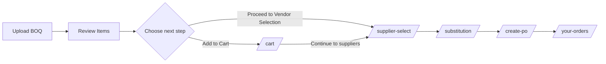
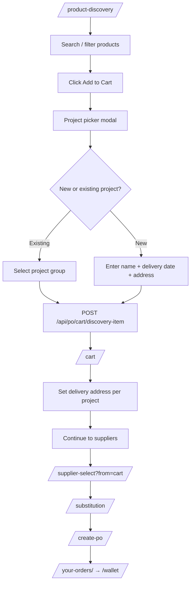
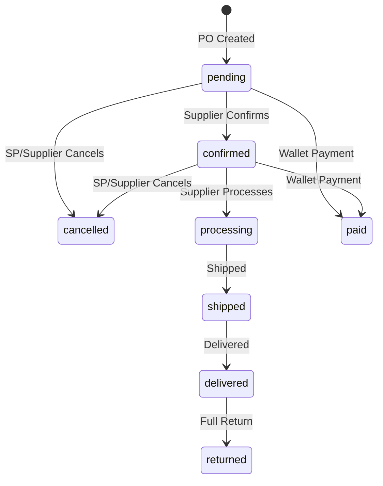

# Service Provider Portal — Testing Documentation

**Product:** Tatva Direct  
**Audience:** QA / Testing Team  
**Version:** 1.0  
**Last updated:** July 2026

---

## Table of Contents

1. [Purpose of This Document](#1-purpose-of-this-document)
2. [Portal Overview](#2-portal-overview)
3. [Terminology](#3-terminology)
4. [Test Environment Setup](#4-test-environment-setup)
5. [Test Data Prerequisites](#5-test-data-prerequisites)
6. [Portal Structure & Navigation](#6-portal-structure--navigation)
7. [Access Control & Security](#7-access-control--security)
8. [Order Placement Workflows](#8-order-placement-workflows)
   - [8.1 Two Ways to Place an Order](#81-two-ways-to-place-an-order)
   - [8.2 Flow A: BOQ-Based Procurement](#82-flow-a-boq-based-procurement)
   - [8.3 Flow B: Discovery-Based Procurement](#83-flow-b-discovery-based-procurement)
   - [8.4 Shared Downstream Steps](#84-shared-downstream-steps-post-order-creation)
   - [8.5 Flow Comparison Table](#85-flow-comparison-table)
   - [8.6 Workflow State & Data Storage](#86-workflow-state--data-storage)
9. [Module-by-Module Test Guide](#9-module-by-module-test-guide)
10. [Order Lifecycle & Status Reference](#10-order-lifecycle--status-reference)
11. [Payment & Wallet Model](#11-payment--wallet-model)
12. [Returns Lifecycle](#12-returns-lifecycle)
13. [API Reference for Testers](#13-api-reference-for-testers)
14. [Test Case Matrix](#14-test-case-matrix)
15. [Negative & Edge Case Scenarios](#15-negative--edge-case-scenarios)
16. [Cross-Role Dependencies](#16-cross-role-dependencies)
17. [Known Limitations](#17-known-limitations)
18. [Related Documents](#18-related-documents)

---

## 1. Purpose of This Document

This document is the **complete testing guide** for the **Service Provider Portal** in Tatva Direct. It covers:

- What the portal is and who uses it
- Every screen, route, and user flow
- Step-by-step test procedures with expected results
- Validation rules and business logic
- API endpoints used by each feature
- Test case IDs for coverage tracking
- Dependencies on Supplier and Admin roles

Use this document alongside the general QA script at `docs/QA_TEST_SCRIPT.md`.

---

## 2. Portal Overview

### What is the Service Provider Portal?

The Service Provider Portal is the **buyer / procurement interface** for Tatva Direct. In the database, a service provider is a user with:

```
user_type = 'service_provider'
```

Despite the name, service providers act as **buyers** in the platform. They:

- Upload and normalize BOQs (Bill of Quantities)
- Discover products in the supplier catalog
- Rank and select suppliers for each line item
- Build a cart and create Purchase Orders (POs)
- Pay for orders via a **customer wallet**
- Track orders, request returns, and manage their profile

The portal is **not a separate application**. It is part of the main React SPA, with its own sidebar, theme, and route guards.

### Architecture at a Glance

| Layer | Location |
|-------|----------|
| Frontend routes | `frontend/src/App.jsx` |
| Route guard | `frontend/src/components/ServiceProviderRoute.jsx` |
| App shell (sidebar, top bar) | `frontend/src/components/sp/SpAppShell.jsx` |
| Navigation config | `frontend/src/utils/spNavConfig.js` |
| Procurement workflow state | `frontend/src/utils/spWorkflow.js` |
| Backend API mount | `backend/routes/api.js` |
| Auth middleware | `backend/middleware/authMiddleware.js` |
| SP dashboard APIs | `backend/controllers/dashboard/serviceProviderDashboardRoutes.js` |

---

## 3. Terminology

| Term in UI | Term in Code / DB | Meaning |
|------------|-------------------|---------|
| Service Provider | `service_provider` | Buyer / customer who places orders |
| Supplier | `supplier` | Seller who fulfills orders |
| Vendor | `vendors` API module | Supplier candidates ranked during selection |
| BOQ | `boqs` table | Bill of Quantities — list of required materials |
| PO / Purchase Order | `orders` table | Order placed with a supplier |
| Cart | `po_carts` table | Draft PO stored server-side (one per SP) |
| Wallet | `wallets` (`wallet_type = 'customer'`) | Prepaid balance used to pay orders |
| Project | `profile.projects[]` | Construction/site project metadata |
| Shipping Address | `profile.shippingAddresses[]` | Delivery destinations |

---

## 4. Test Environment Setup

### 4.1 Start the Application

**Terminal 1 — Backend:**

```bash
cd backend
npm install
npm run dev
```

**Terminal 2 — Frontend:**

```bash
cd frontend
npm install
npm run dev
```

**Terminal 3 — Automated tests (optional baseline):**

```bash
cd backend && npm test
cd frontend && npm test
```

### 4.2 Required Environment Variables

Ensure `backend/.env` is configured. Key variables for SP portal testing:

| Variable | Required For |
|----------|--------------|
| `JWT_SECRET` | Authentication |
| `SUPABASE_URL`, `SUPABASE_SERVICE_ROLE_KEY` | Database |
| `RAZORPAY_KEY_ID`, `RAZORPAY_KEY_SECRET` | Wallet top-up & payments |
| `WALLET_MIN_TOPUP_INR` | Minimum wallet top-up (default: ₹100) |
| `DIRECT_ORDER_PAYMENT_DISABLED` | When `true`, forces wallet-only order payment |
| `GEMINI_API_KEY` / `OPENAI_API_KEY` / `ANTHROPIC_API_KEY` | BOQ normalize, substitutions, AI features |
| `GOOGLE_MAPS_API_KEY` | Geo/distance in supplier ranking |
| `LOGISTICS_*` | Transport quotes and booking |
| `VOICE_*` | Voice commerce WebSocket |
| `FRONTEND_URL`, `ALLOWED_ORIGINS` | CORS and share links |

### 4.3 Default URLs

| Service | Typical URL |
|---------|-------------|
| Frontend | `http://localhost:5173` |
| Backend API | `http://localhost:5000/api` |
| Voice WebSocket | `ws://localhost:5000/api/voice/ws` |

---

## 5. Test Data Prerequisites

Before testing, ensure the following exist in the system:

| # | Requirement | Why |
|---|-------------|-----|
| 1 | **1 Service Provider account** (`user_type = service_provider`) | Primary test user |
| 2 | **1+ Supplier account(s)** with approved products and stock | Vendor selection & order fulfillment |
| 3 | **1 Admin account** | User management, order status updates (for rating/returns tests) |
| 4 | Supplier products in **approved** status with **stock > 0** | Discovery, cart, checkout |
| 5 | At least one **product category** with searchable products | Product discovery tests |
| 6 | Razorpay **test keys** configured | Wallet top-up tests |
| 7 | SP profile with **complete address** (line1, city, state, pincode, country) | Supplier ranking uses geo |
| 8 | At least one **shipping address** on SP profile | PO creation / delivery |

### Sample Test User Checklist

```
Service Provider:
  - Email: sp-test@example.com
  - Password: (min 6 chars)
  - Company name filled
  - Address complete
  - At least 1 shipping address
  - Wallet balance: ₹0 initially (for top-up flow test)

Supplier:
  - Email: supplier-test@example.com
  - Products: 3+ approved with stock
  - Outlets/branches configured (for pickup options)

Admin:
  - Email: admin@example.com
  - Can update order statuses for rating/return tests
```

---

## 6. Portal Structure & Navigation

### 6.1 Sidebar Navigation Groups

| Group | Menu Items | Route |
|-------|------------|-------|
| **Home** | Dashboard | `/dashboard` |
| **Procure** | BOQ Normalize | `/boq-normalize` |
| | Product Discovery | `/product-discovery` |
| | Voice Shop | `/voice` |
| | Supplier Select | `/supplier-select` |
| | Substitution | `/substitution` |
| | Cart | `/cart` |
| | Create PO | `/create-po` |
| | Transport | `/transport-suggestion` |
| **Orders** | Your Orders | `/your-orders` |
| | Wallet | `/wallet` |
| | Returns | `/returns` |
| **Account** | Portal Theme | `/portal-theme` |

**Profile** is accessible from the top bar at `/profile` (not in sidebar).

**All BOQs** list is available at `/boqs` (linked from dashboard, not in main sidebar).

### 6.2 Public Routes (No Login Required)

| Route | Purpose |
|-------|---------|
| `/login` | Login page |
| `/signup` | Registration page |
| `/shared-cart/:token` | View a shared cart link |
| `/c/:token` | Short alias for shared cart |

### 6.3 Route Protection Summary

| Route Type | Guard | Behavior |
|------------|-------|----------|
| `/login`, `/signup` | Public | Redirects to `/dashboard` if already logged in as SP |
| `/dashboard`, `/profile` | `ProtectedRoute` only | Any authenticated user; APIs enforce SP scope |
| All other SP routes | `ProtectedRoute` + `ServiceProviderRoute` | Non-SP users redirected to their role dashboard |
| Root `/` | Role-based | SP → `/dashboard` |

### 6.4 Order Placement — Two Workflows

Service providers can place orders via **two independent entry paths**. Both converge at **Supplier Select** and share the same checkout, payment, and post-order steps.

| Workflow | Entry Page | Best For |
|----------|------------|----------|
| **Flow A — BOQ-Based** | `/boq-normalize` | Bulk requirements from a BOQ file (construction/project procurement) |
| **Flow B — Discovery-Based** | `/product-discovery` | Ad-hoc or catalog shopping without a BOQ file |

The sidebar workflow stepper shows: `BOQ → Discover → Supplier → Substitute → Cart → Create PO`. In practice:
- **BOQ flow** may skip Product Discovery entirely.
- **Discovery flow** skips BOQ Normalize entirely.

See [Section 8](#8-order-placement-workflows) for full step-by-step details on both flows.

Workflow state is stored in:
- **Browser:** `localStorage` key `spBoqWorkflow`
- **Server:** `po_carts.draft_payload` (one cart per service provider)

When a different user logs in on the same browser, workflow storage is cleared automatically.

---

## 7. Access Control & Security

### 7.1 Authentication

| Action | API | Validation |
|--------|-----|------------|
| Signup | `POST /api/auth/signup` | name required, email valid, password ≥ 6 chars, `userType` = `supplier` or `service_provider` |
| Login | `POST /api/auth/login` | email + password; rejects deactivated accounts (`is_active = false`) |
| Update password | `PATCH /api/auth/update-password` | current password + new password ≥ 6 chars |
| Logout | `POST /api/auth/logout` | Clears session |

**Token storage:** JWT stored in `localStorage` as `token`. Sent as `Authorization: Bearer <token>`.

**Token expiry:** Default 7 days (`JWT_EXPIRES_IN`).

### 7.2 Authorization Rules

| Rule | Expected Behavior |
|------|-------------------|
| SP-only routes | Return `403` if `user_type !== 'service_provider'` |
| Order access | SP can only access orders where `service_provider_id = their user ID` |
| BOQ access | SP can only access BOQs they own |
| Cart | One cart per SP (`po_carts.service_provider_id` is unique) |
| Wallet | Only SP role can access `/api/wallet/*` |
| Direct payment disabled | `PATCH .../payment` with `paid` returns `403 DIRECT_PAYMENT_DISABLED` when env flag is set |

### 7.3 Access Control Test Cases

| ID | Test | Steps | Expected |
|----|------|-------|----------|
| **AUTH-01** | SP login | Login as service provider | Redirect to `/dashboard` |
| **AUTH-02** | SP signup | Register as Service Provider | Redirect to `/boq-normalize` |
| **AUTH-03** | Wrong role on SP route | Login as supplier, open `/cart` | Redirect to `/supplier-dashboard` |
| **AUTH-04** | Wrong role on SP route | Login as admin, open `/wallet` | Redirect to `/admin-dashboard` |
| **AUTH-05** | Unauthenticated access | Open `/your-orders` without login | Redirect to `/login` |
| **AUTH-06** | Deactivated account | Admin deactivates SP, SP tries login | Login rejected with error message |
| **AUTH-07** | Token expiry | Use expired/invalid token on API | `401 Unauthorized` |
| **AUTH-08** | Cross-user order access | SP A tries to view SP B's order via API | `403` or `404` |

---

## 8. Order Placement Workflows

This section documents the **two distinct order placement workflows** in the Service Provider Portal. QA must test **both flows** end-to-end before every release.

---

### 8.1 Two Ways to Place an Order

```mermaid
flowchart TB
    subgraph entry [Entry Points — choose ONE]
        A1[Flow A: Upload BOQ]
        A2[Flow B: Browse Catalog]
    end

    subgraph boq [Flow A — BOQ-Based]
        B1[/boq-normalize/]
        B2{After normalize}
        B3[Proceed to Vendor Selection]
        B4[Add to Cart]
    end

    subgraph discovery [Flow B — Discovery-Based]
        C1[/product-discovery/]
        C2[Add to Cart with project picker]
        C3[/cart/]
    end

    subgraph shared [Shared Steps — both flows]
        D1[/supplier-select/]
        D2[/substitution/]
        D3[/create-po/]
        D4[/your-orders/]
        D5[/wallet/ — Pay from Wallet]
    end

    A1 --> B1
    B1 --> B2
    B2 -->|Direct path| B3 --> D1
    B2 -->|Via cart| B4 --> C3

    A2 --> C1 --> C2 --> C3
    C3 -->|Continue to suppliers| D1

    D1 --> D2 --> D3 --> D4 --> D5
```

**Key rule:** Product Discovery is **not required** in the BOQ flow. BOQ Normalize is **not required** in the Discovery flow. Both flows must pass through **Supplier Select** before checkout.

---

### 8.2 Flow A: BOQ-Based Procurement

Use this flow when the buyer has a **Bill of Quantities (BOQ) file** — typical for construction and infrastructure projects.

#### Flow A — High-Level Path

```
Signup/Login
    → BOQ Normalize (upload file)
    → [Branch A] Proceed to Vendor Selection  — OR —  [Branch B] Add to Cart
    → Supplier Select
    → Substitution (auto-skips if no suggestions)
    → Create PO
    → Your Orders
    → Wallet Top-up → Pay from Wallet
```

#### Flow A — Detailed Steps

| Step | Page | User Action | System Behavior | Expected Result |
|------|------|-------------|-----------------|-----------------|
| **A-1** | `/signup` or `/login` | Register / log in as Service Provider | JWT issued | New SP → `/boq-normalize`; returning SP → `/dashboard` |
| **A-2** | `/profile` | Complete address and shipping addresses | Profile saved | Address available for supplier distance ranking |
| **A-3** | `/boq-normalize` | Enter site location, required date (optional geo) | Fields stored as project metadata | Project context ready |
| **A-4** | `/boq-normalize` | Upload BOQ file (PDF, Excel, CSV, image) | `POST /api/boq/normalize` | AI parses file; `boqs` record created; items shown in table |
| **A-5** | `/boq-normalize` | Review normalized items | Each line shows name, qty, unit, matched product, confidence % | Low-confidence matches flagged; user can confirm |
| **A-6** | `/boq-normalize` | (Optional) Request missing product | `POST /api/boq/request-product` | Product request logged against BOQ item |
| **A-7a** | `/boq-normalize` | Click **"Proceed to Vendor Selection"** | Navigates to `/supplier-select` with items in navigation state; `lastBoqId` saved | Skips cart; goes directly to supplier ranking |
| **A-7b** | `/boq-normalize` | Click **"Add to Cart"** | Saves items to `po_carts` as a `boqGroup` with `boqId` + project meta; navigates to `/cart` | Cart updated; cart badge increases |
| **A-8** | `/supplier-select` | Review ranked suppliers per line item | `POST /api/vendors/rank` | Suppliers ranked by price, distance, scorecard, stock |
| **A-9** | `/supplier-select` | Select one supplier per line item | Selection saved to `selectedVendors` in workflow + cart draft | All items have a supplier assigned |
| **A-10** | `/supplier-select` | Click continue | Navigates to `/substitution` | Substitution page loads |
| **A-11** | `/substitution` | Review AI suggestions (or auto-skip) | `POST /api/substitutions/suggest` | If no suggestions → auto-redirects to `/create-po` |
| **A-12** | `/create-po` | Fill delivery address, payment method, confirm transport | `POST /api/po/group` → `POST /api/po/create` | Order(s) created (one per supplier group); redirect to `/your-orders` |
| **A-13** | `/wallet` | Top up wallet | `POST /api/wallet/topup/create` + confirm | Balance credited |
| **A-14** | `/your-orders` | Pay order from wallet | `POST /api/wallet/orders/:id/pay` | `payment_status` → `paid` |

#### Flow A — Branch Diagram



#### Flow A — BOQ-Specific Data

| Field | Where Stored | Notes |
|-------|--------------|-------|
| `boqId` | `boqs.id`, `localStorage.lastBoqId`, cart `boqGroups[].boqId` | Links order back to source BOQ |
| `boqProject` | Cart `boqGroups[].boqProject` | `{ location, requiredDate, siteGeo }` |
| Normalized items | `boq_items` table + workflow `normalizedItems` | AI-matched catalog products |
| `service_provider_id` | `boqs.service_provider_id` | Owner scope |

#### Flow A — Test Cases

| ID | Test | Steps | Expected |
|----|------|-------|----------|
| **FLOW-A-01** | Full BOQ direct path | Upload BOQ → Proceed to Vendor Selection → select suppliers → Create PO → pay | Order created with `boq_id` linked |
| **FLOW-A-02** | Full BOQ via cart | Upload BOQ → Add to Cart → Continue to suppliers → Create PO → pay | Order created; cart had `boqId` in group |
| **FLOW-A-03** | Ambiguous BOQ match | Upload BOQ with fuzzy product names | "Did you mean?" confirmation dialog shown |
| **FLOW-A-04** | Request missing product | Item with no supplier → Request Product | Request saved; item flagged |
| **FLOW-A-05** | BOQ with site geo | Enter lat/lng on BOQ page | Geo used in supplier distance ranking |
| **FLOW-A-06** | Re-upload new BOQ | Upload second BOQ while first in cart | New BOQ group added; previous groups retained |
| **FLOW-A-07** | Delete BOQ from dashboard | Delete BOQ on dashboard | BOQ removed from list |
| **FLOW-A-08** | Skip Product Discovery | Complete order without visiting `/product-discovery` | Order completes successfully |

---

### 8.3 Flow B: Discovery-Based Procurement

Use this flow when the buyer wants to **browse the catalog and add products directly** — no BOQ file needed. Typical for repeat orders, spot purchases, or supplementing a project.

#### Flow B — High-Level Path

```
Login
    → Product Discovery (search / browse)
    → Add to Cart (with project + shipping picker)
    → Cart (review + set delivery address)
    → Supplier Select
    → Substitution (auto-skips if no suggestions)
    → Create PO
    → Your Orders
    → Wallet Top-up → Pay from Wallet
```

#### Flow B — Detailed Steps

| Step | Page | User Action | System Behavior | Expected Result |
|------|------|-------------|-----------------|-----------------|
| **B-1** | `/login` | Log in as Service Provider | JWT issued | Redirect to `/dashboard` |
| **B-2** | `/profile` | Ensure at least one shipping address exists | — | Required for add-to-cart and supplier select |
| **B-3** | `/product-discovery` | Search by name, brand, category, or description | `GET /api/supplier/products/search` | Approved products with active supplier listings shown |
| **B-4** | `/product-discovery` | Click **Add to Cart** on a product | Project picker modal opens | Modal shows existing cart projects + "New project" option |
| **B-5** | Project picker | Choose **existing project** OR create **new project** | — | See project rules below |
| **B-6** | Project picker (new project) | Enter project name + expected delivery date | Validated: date ≥ today, name required | Fields required before confirm |
| **B-7** | Project picker | Select or enter shipping address | Saved address from profile OR new address form | `POST /api/profile/shipping-addresses` if new |
| **B-8** | Project picker | Confirm add to cart | `POST /api/po/cart/discovery-item` | Item saved to server cart under correct `boqGroup`; toast "Added to cart" |
| **B-9** | `/product-discovery` | (Repeat B-4–B-8 for more products) | Same product to same project → qty increased (not duplicate row) | Cart badge updates |
| **B-10** | `/cart` | Review items grouped by project | `GET /api/po/cart` | Items shown per project group; no `boqId` on discovery-only projects |
| **B-11** | `/cart` | Set / confirm delivery address per project | Address saved on `boqProject.shippingAddress` | Required before supplier select |
| **B-12** | `/cart` | Click **"Continue to suppliers"** (or per-line **"Select supplier"**) | Navigates to `/supplier-select?from=cart` with scoped items | Only selected project/lines passed to ranking |
| **B-13** | `/supplier-select` | Rank and select suppliers | `POST /api/vendors/rank` (no `boqId`; uses cart shipping address) | Suppliers ranked using delivery address context |
| **B-14** | `/substitution` | Review or auto-skip substitutions | Same as Flow A | Redirects to `/create-po` |
| **B-15** | `/create-po` | Checkout (loads cart from server) | `POST /api/po/create` | Order(s) created; redirect to `/your-orders` |
| **B-16** | `/wallet` + `/your-orders` | Top up and pay | Same as Flow A | `payment_status` → `paid` |

#### Flow B — Project Picker Rules

When adding a product from Discovery, the user must assign it to a **project group** in the cart:

| Scenario | Required Fields | API Payload |
|----------|-----------------|-------------|
| Add to **existing project** | Select project group | `{ productId, quantity, groupId, shippingAddressId? }` |
| Add to **new project** | Project name + expected delivery date (YYYY-MM-DD, not past) + shipping address | `{ productId, quantity, projectName, expectedDeliveryDate, shippingAddressId/shippingAddress }` |
| Same product, same project again | — | Quantity incremented on existing line (no duplicate row) |
| Same project name + same delivery date | — | Error: "A project with the same name and expected delivery date already exists" |
| Product with no eligible supplier | — | Error: "not currently listed by the terminal role supplier" |

#### Flow B — Diagram



#### Flow B — Discovery-Specific Data

| Field | Where Stored | Notes |
|-------|--------------|-------|
| `boqId` | `null` on discovery-only projects | No BOQ file involved |
| `boqName` | Cart `boqGroups[].boqName` | Project name entered in picker (or product name as default) |
| `boqProject.requiredDate` | Cart `boqGroups[].boqProject` | Expected delivery date from picker |
| `boqProject.shippingAddress` | Cart `boqGroups[].boqProject` | Required before supplier select |
| `productId` | Cart item | Direct catalog product reference |
| Item `id` | `pd-item-<timestamp>-<random>` | Discovery-generated line ID |

#### Flow B — Test Cases

| ID | Test | Steps | Expected |
|----|------|-------|----------|
| **FLOW-B-01** | Full discovery path | Search product → add to new project → cart → suppliers → Create PO → pay | Order created without `boq_id` |
| **FLOW-B-02** | Add to existing project | Add second product to same project group | Single project group; qty/lines updated |
| **FLOW-B-03** | New project validation | Try new project without delivery date | Error: date required |
| **FLOW-B-04** | Past delivery date | Enter yesterday's date | Error: cannot be in the past |
| **FLOW-B-05** | Duplicate project name+date | Create project with same name and date | Error: duplicate project |
| **FLOW-B-06** | New shipping address inline | Add new address in project picker | Address saved to profile and used |
| **FLOW-B-07** | Supplier select without address | Go to suppliers before setting delivery address | Error: "Please set a delivery address" |
| **FLOW-B-08** | Per-line supplier select | Click "Select supplier" on one cart line only | Only that line sent to `/supplier-select?from=cart` |
| **FLOW-B-09** | Product with no supplier | Add product with `supplierCount = 0` | Error before picker opens |
| **FLOW-B-10** | Skip BOQ entirely | Complete order without visiting `/boq-normalize` | Order completes successfully |
| **FLOW-B-11** | Same product twice same project | Add same product twice to one project | Quantity increases; no duplicate line |
| **FLOW-B-12** | Category filter | Filter by category | Results narrowed correctly |

---

### 8.4 Shared Downstream Steps (Post-Order Creation)

After **Create PO**, both flows follow the same path:

| Step | Page | Action | Expected |
|------|------|--------|----------|
| 1 | `/your-orders` | View newly created order(s) | Order(s) listed with `pending` status, `payment_status = pending` |
| 2 | `/wallet` | Top up wallet (if balance insufficient) | Razorpay modal → balance credited |
| 3 | `/your-orders` | Pay from wallet | `payment_status` → `paid` |
| 4 | — | Supplier confirms and fulfills | Status progresses: `confirmed` → `processing` → `shipped` → `delivered` |
| 5 | `/your-orders` | Rate supplier (after delivered + paid) | Rating saved |
| 6 | `/returns` | Request return (after delivered) | Return created |

```mermaid
flowchart LR
    A[/create-po/] --> B[/your-orders/]
    B --> C[/wallet/ — top up]
    C --> D[Pay from wallet]
    D --> E[Supplier fulfills]
    E --> F[Rate supplier]
    E --> G[Request return]
```

#### Optional: Transport Step

Both flows can use `/transport-suggestion` before or during checkout to get logistics quotes:
- `POST /api/logistics/quote-transport-groups`
- `POST /api/po/transport/confirm`

This step is optional and may show a fallback if logistics APIs are not configured.

---

### 8.5 Flow Comparison Table

| Aspect | Flow A — BOQ-Based | Flow B — Discovery-Based |
|--------|-------------------|--------------------------|
| **Entry page** | `/boq-normalize` | `/product-discovery` |
| **Item source** | AI-parsed BOQ file | Catalog search |
| **Signup redirect** | `/boq-normalize` | `/dashboard` (then navigate to Discovery) |
| **Project setup** | Site location + required date on BOQ page | Project name + delivery date in add-to-cart picker |
| **Shipping address** | Set on cart before supplier select (if via cart) or at Create PO | Set in project picker or on cart page |
| **`boqId` on order** | Yes — linked to uploaded BOQ | No — `boqId` is null |
| **Cart entry** | Optional ("Add to Cart" button) | Mandatory (every product goes to cart first) |
| **Supplier select entry** | Direct from BOQ ("Proceed to Vendor Selection") OR from cart | Always from cart ("Continue to suppliers") |
| **Supplier select URL** | `/supplier-select` | `/supplier-select?from=cart` |
| **Ranking context** | SP profile address + BOQ site geo | Cart project shipping address |
| **Product Discovery step** | Skipped | Required |
| **BOQ Normalize step** | Required | Skipped |
| **Primary API for adding items** | `POST /api/boq/normalize` | `POST /api/po/cart/discovery-item` |
| **Typical use case** | Project BOQ upload (construction) | Spot buy, repeat order, catalog browse |

---

### 8.6 Workflow State & Data Storage

Both flows read/write the same cart structure on the server:

```json
{
  "boqGroups": [
    {
      "groupId": "uuid-or-generated-id",
      "boqId": "uuid-or-null",
      "boqName": "Project name",
      "boqProject": {
        "location": "...",
        "requiredDate": "YYYY-MM-DD",
        "shippingAddress": { "line1", "city", "state", "pincode", "country" },
        "shippingAddressId": "uuid",
        "siteGeo": { "lat", "lng" }
      },
      "items": [ /* line items */ ],
      "selectedVendors": { "itemId": "supplierId" },
      "substitutions": [ /* approved substitutions */ ]
    }
  ]
}
```

| Storage | Key / Table | Used By |
|---------|-------------|---------|
| Server cart | `po_carts.draft_payload` | Both flows — source of truth |
| Browser workflow | `localStorage.spBoqWorkflow` | BOQ flow primarily; discovery uses server cart |
| Last BOQ ID | `localStorage.lastBoqId` | BOQ flow only |
| Checkout session | `sessionStorage` checkout session key | Create PO inventory reservation |

**Important for testers:**
- Discovery flow relies primarily on **server cart** (`GET /api/po/cart`). Clearing browser `localStorage` does not clear the server cart.
- BOQ "Proceed to Vendor Selection" passes items via **React navigation state** in addition to workflow storage.
- Cart page **"Skip to create PO"** is only valid when suppliers are already selected for all lines.

---

### 8.7 Release Sign-Off — Both Flows Required

Before sign-off, QA must confirm **both** flows pass end-to-end:

- [ ] **Flow A (BOQ direct):** Upload BOQ → Proceed to Vendor Selection → Create PO → Wallet pay
- [ ] **Flow A (BOQ via cart):** Upload BOQ → Add to Cart → Suppliers → Create PO → Wallet pay
- [ ] **Flow B (Discovery):** Product Discovery → Add to Cart → Suppliers → Create PO → Wallet pay
- [ ] Mixed cart: BOQ project + Discovery project in same cart → checkout both groups
- [ ] Post-order: rating and returns work for orders from both flows

---

## 9. Module-by-Module Test Guide

---

### 9.1 Registration & Login

**Pages:** `/signup`, `/login`  
**APIs:** `POST /api/auth/signup`, `POST /api/auth/login`

#### Signup Fields

| Field | Required | Validation |
|-------|----------|------------|
| Name | Yes | Non-empty |
| Email | Yes | Valid email format, must be unique |
| Password | Yes | Minimum 6 characters |
| Confirm Password | Yes (UI) | Must match password |
| User Type | Yes | Must select "Service Provider" |
| Company | No | Optional |

#### Signup Test Cases

| ID | Test | Expected |
|----|------|----------|
| **REG-01** | Valid SP signup | Account created; redirect to `/boq-normalize` |
| **REG-02** | Password < 6 chars | Error: "Password must be at least 6 characters" |
| **REG-03** | Passwords don't match | Error: "Passwords do not match" |
| **REG-04** | Duplicate email | Error from API |
| **REG-05** | No user type selected | Form validation error |
| **REG-06** | Invalid email format | Validation error |

#### Login Test Cases

| ID | Test | Expected |
|----|------|----------|
| **LOGIN-01** | Valid SP credentials | Redirect to `/dashboard` |
| **LOGIN-02** | Wrong password | Error message |
| **LOGIN-03** | Non-existent email | Error message |
| **LOGIN-04** | Already logged in, visit `/login` | Redirect to `/dashboard` |
| **LOGIN-05** | Shared cart deep link pending | After login, cart token applied via `POST /api/cart-share/:token/apply` |

---

### 9.2 Dashboard

**Page:** `/dashboard`  
**Component:** `ServiceProviderDashboard.jsx`  
**API:** `GET /api/dashboard/service-provider`

#### What the Dashboard Shows

| Section | Data |
|---------|------|
| Stat cards | Total BOQs, Active POs, Total Spent, Pending Approvals |
| Recent BOQs | Latest BOQ list with status, project, value |
| Recent Orders | Latest orders with status, payment status, supplier |
| Notifications | Unread count + notification panel |
| Wallet balance | Current customer wallet balance |

#### Dashboard Actions

| Action | API | When Available |
|--------|-----|----------------|
| View order details | `GET /api/dashboard/service-provider/orders/:id` | Any owned order |
| Pay from wallet | `POST /api/wallet/orders/:id/pay` | Unpaid orders with sufficient balance |
| Rate supplier | `POST /api/po/:id/rating` | Order `delivered` + `paid` |
| Request return | `POST /api/dashboard/service-provider/orders/:id/returns` | Order `delivered` |
| Delete BOQ | `DELETE /api/boq/:id` | Owned BOQ |
| Delete/cancel order | `DELETE /api/dashboard/service-provider/orders/:id` | Not delivered+paid |
| Mark notification read | `PATCH /api/supplier/notifications/:id/read` | Any notification |
| Mark all read | `PATCH /api/supplier/notifications/read-all` | Any notifications |

#### Dashboard Test Cases

| ID | Test | Expected |
|----|------|----------|
| **DASH-01** | Load dashboard | Stats and lists load without error |
| **DASH-02** | Click recent order | Order detail modal opens with full info |
| **DASH-03** | Pay-later alert | Credit orders nearing due date show notification |
| **DASH-04** | View BOQ detail | BOQ detail dialog shows items and project |
| **DASH-05** | Delete BOQ | BOQ removed from list |
| **DASH-06** | Notification bell | Unread count matches unread notifications |
| **DASH-07** | Open order from notification | Order modal opens for linked order |

---

### 9.3 BOQ Normalize

> **Workflow:** Flow A — BOQ-Based only. See [Section 8.2](#82-flow-a-boq-based-procurement).

**Page:** `/boq-normalize`  
**Related:** `/boqs` (all BOQs list)  
**APIs:**
- `POST /api/boq/normalize` (multipart file upload)
- `POST /api/boq/request-product`
- `GET /api/boq/`
- `GET /api/boq/:id/items`
- `DELETE /api/boq/:id`

#### Flow

1. User uploads a BOQ file (PDF, Excel, CSV, or image).
2. Optional: enter site location, required date, coordinates.
3. AI parses and normalizes line items (name, quantity, unit, specifications).
4. System creates a `boqs` record and associated `boq_items`.
5. For items not found in catalog, user can **request a new product**.
6. Normalized items are saved to workflow state for next steps.
7. User chooses next step:
   - **"Proceed to Vendor Selection"** → goes directly to `/supplier-select`
   - **"Add to Cart"** → saves to server cart and goes to `/cart`

#### BOQ Statuses

| Status | Meaning |
|--------|---------|
| `draft` | Initial state |
| `normalized` | AI parsing complete |
| `vendor_selection` | Suppliers being selected |
| `completed` | Procurement complete |
| `cancelled` | BOQ cancelled |

#### BOQ Test Cases

| ID | Test | Expected |
|----|------|----------|
| **BOQ-01** | Upload valid BOQ file | Items normalized and displayed |
| **BOQ-02** | Upload unsupported file type | Error message |
| **BOQ-03** | Upload empty/corrupt file | Graceful error |
| **BOQ-04** | Request missing product | Product request created, linked to BOQ |
| **BOQ-05** | View all BOQs at `/boqs` | List shows all SP's BOQs |
| **BOQ-06** | Delete BOQ | BOQ removed; workflow state cleared if linked |
| **BOQ-07** | Re-normalize new BOQ | Previous workflow replaced |
| **BOQ-08** | BOQ with site location | Location saved in project metadata |

#### Product Request Fields

| Field | Required |
|-------|----------|
| Name | Yes |
| Category | Yes |
| Unit | Yes |
| Description | No |
| Brand | No |

---

### 9.4 Product Discovery

> **Workflow:** Flow B — Discovery-Based only. See [Section 8.3](#83-flow-b-discovery-based-procurement).

**Page:** `/product-discovery`  
**APIs:**
- `GET /api/supplier/products/search?q=...`
- `POST /api/po/cart/discovery-item`
- `POST /api/profile/shipping-addresses` (if adding address inline)

#### Flow

1. Search products by name, brand, SKU, or partial text.
2. Filter by category.
3. View product details (images, specs, price, stock).
4. Click **Add to Cart** → project picker modal opens.
5. Assign product to an **existing cart project** or create a **new project** (name + delivery date + shipping address).
6. Confirm → `POST /api/po/cart/discovery-item` saves item to server cart.
7. Navigate to `/cart` → set delivery address → **Continue to suppliers**.

#### Discovery Test Cases

| ID | Test | Expected |
|----|------|----------|
| **DISC-01** | Search by product name | Relevant results returned |
| **DISC-02** | Search by brand | Filtered results |
| **DISC-03** | Search partial text | Fuzzy/partial matches |
| **DISC-04** | Category filter | Results narrowed to category |
| **DISC-05** | Empty search query | Shows discoverable approved products |
| **DISC-06** | Add product to cart | Cart badge count increases |
| **DISC-07** | Add product with qty 0 | Validation error or disabled |
| **DISC-08** | Product with no stock | Stock indicator shown; may block add |
| **DISC-09** | Only approved products shown | Unapproved/draft products not visible |

---

### 9.5 Voice Shop

**Page:** `/voice`  
**APIs:**
- `GET /api/voice/health`
- `GET /api/voice/products/:productId/availability`
- WebSocket: `ws://host/api/voice/ws`

#### Flow

1. User starts a voice session.
2. Speaks commands (search products, add to cart, checkout).
3. Voice agent processes intent and updates cart.
4. Cart changes sync to procurement workflow via `voice-cart-updated` event.

#### Voice Test Cases

| ID | Test | Expected |
|----|------|----------|
| **VOICE-01** | Voice health check | API returns healthy status |
| **VOICE-02** | Start voice session | WebSocket connects |
| **VOICE-03** | Search product by voice | Results returned verbally and in UI |
| **VOICE-04** | Add to cart by voice | Cart updated |
| **VOICE-05** | Non-SP user | Route blocked by `ServiceProviderRoute` |

> **Note:** Voice tests require `VOICE_*` environment variables and a working AI provider key.

---

### 9.6 Supplier Select (Vendor Ranking)

> **Workflow:** Shared by both flows. Entry differs:
> - **Flow A:** from `/boq-normalize` ("Proceed to Vendor Selection") or from `/cart`
> - **Flow B:** always from `/cart` with `?from=cart` query param

**Page:** `/supplier-select`  
**API:** `POST /api/vendors/rank`

#### Flow

1. System loads normalized BOQ items from workflow.
2. For each item, backend ranks eligible suppliers based on:
   - Price
   - Geographic distance (uses SP address + Google Maps)
   - Supplier scorecards
   - Brand terminal roles
   - Stock availability / reservations
3. User reviews ranked suppliers per line item.
4. User selects one supplier per item.
5. Selection saved to workflow (`selectedVendors`).

#### Supplier Select Test Cases

| ID | Test | Expected |
|----|------|----------|
| **VEND-01** | Rank suppliers for BOQ items | Ranked list per item with scores |
| **VEND-02** | Select supplier per item | Selection persisted in workflow |
| **VEND-03** | No suppliers for an item | Empty state or product request prompt |
| **VEND-04** | SP without address | Ranking may fail or use defaults — verify behavior |
| **VEND-05** | Re-rank after profile address update | Distance scores change |
| **VEND-06** | Navigate without BOQ items | Redirect or empty state message |

---

### 9.7 Substitution

**Page:** `/substitution`  
**API:** `POST /api/substitutions/suggest`

#### Flow

1. System sends BOQ items + selected vendors to AI.
2. AI suggests alternative products where exact match is unavailable.
3. User accepts or rejects each substitution.
4. Accepted substitutions saved to workflow.

#### Substitution Test Cases

| ID | Test | Expected |
|----|------|----------|
| **SUB-01** | Get substitution suggestions | AI suggestions displayed per item |
| **SUB-02** | Accept substitution | Item replaced in workflow |
| **SUB-03** | Reject substitution | Original item retained |
| **SUB-04** | Skip substitution step | Can proceed to cart with original items |
| **SUB-05** | No AI key configured | Graceful error message |

---

### 9.8 Cart

> **Workflow:** Used by **both flows**. Flow A (optional path) and Flow B (required path). See [Section 8.5](#85-flow-comparison-table).

**Page:** `/cart`  
**APIs:**
- `GET /api/po/cart`
- `PUT /api/po/cart`
- `PATCH /api/po/cart/items/:itemId/quantity`
- `DELETE /api/po/cart/items/:itemId`
- `PATCH /api/po/cart/groups/:groupId/name`
- `PATCH /api/po/cart/transport-selection`
- `DELETE /api/po/cart` (clear)
- `POST /api/cart-share` (share link)
- `GET /api/cart-share/:token` (public view)
- `POST /api/cart-share/:token/apply`

#### Flow

1. Cart loads draft from server (`po_carts` table).
2. Items displayed grouped by supplier.
3. User can adjust quantities, remove items, rename groups.
4. User can share cart via link (`/shared-cart/:token` or `/c/:token`).
5. Transport selection can be configured per group.

#### Cart Test Cases

| ID | Test | Expected |
|----|------|----------|
| **CART-01** | View cart with items | Items grouped by supplier |
| **CART-02** | Update item quantity | Quantity saved server-side |
| **CART-03** | Remove item | Item removed from cart |
| **CART-04** | Clear cart | All items removed |
| **CART-05** | Rename supplier group | Group name updated |
| **CART-06** | Share cart link | Link generated; public view works |
| **CART-07** | Apply shared cart while logged in | Cart merged/applied |
| **CART-08** | Cart badge count | Sidebar badge matches item count |
| **CART-09** | Empty cart | Empty state with link to discovery |

---

### 9.9 Create PO (Checkout)

**Page:** `/create-po`  
**APIs:**
- `POST /api/po/group` — Group items by supplier
- `POST /api/po/credit-check` — Pay-later eligibility
- `POST /api/po/checkout-reservations` — Reserve inventory
- `POST /api/po/create` — Create order(s)
- `POST /api/po/transport/confirm` — Confirm transport
- `POST /api/logistics/bridge-session` — Logistics bridge

#### Flow

1. Load cart draft and vendor selections.
2. Group items by selected supplier (`POST /api/po/group`).
3. Fill shipping/billing/delivery details.
4. Select payment method:
   - **Wallet** (default, recommended)
   - **Credit / Pay-later** (requires credit check pass)
5. Run inventory checkout reservations.
6. Confirm transport per group (optional).
7. Submit → `POST /api/po/create`.
8. One or more `orders` created (one per supplier group).
9. Redirect to `/your-orders`.

#### Create PO Test Cases

| ID | Test | Expected |
|----|------|----------|
| **CHK-01** | Create PO with valid data | Order(s) created; redirect to Your Orders |
| **CHK-02** | Missing shipping address | Validation error |
| **CHK-03** | Missing delivery fields | Validation error shown |
| **CHK-04** | Multiple supplier groups | Separate orders per supplier |
| **CHK-05** | Credit check — eligible | Pay-later option enabled |
| **CHK-06** | Credit check — ineligible | Pay-later disabled; wallet required |
| **CHK-07** | Insufficient stock | Reservation fails with clear error |
| **CHK-08** | Empty cart / no groups | Cannot proceed; error message |
| **CHK-09** | Transport confirmation | Transport details saved on order |
| **CHK-10** | Order amounts | Totals match cart calculations (incl. GST) |

---

### 9.10 Transport

**Page:** `/transport-suggestion`  
**APIs:**
- `POST /api/logistics/quote-transport-groups`
- `POST /api/logistics/bridge-session`
- `GET /api/logistics/bridge-session/:id`

#### Flow

1. System calculates transport options per supplier group.
2. Shows quotes (cost, ETA, carrier).
3. User selects transport option.
4. Bridge session created for logistics partner integration.

#### Transport Test Cases

| ID | Test | Expected |
|----|------|----------|
| **TRANS-01** | Get transport quotes | Quotes displayed per group |
| **TRANS-02** | Select transport option | Selection saved to cart/order |
| **TRANS-03** | No logistics configured | Graceful fallback or skip |
| **TRANS-04** | Bridge session created | Session ID returned and viewable |

---

### 9.11 Your Orders

**Page:** `/your-orders`  
**APIs:**
- `GET /api/dashboard/service-provider` (order list)
- `GET /api/dashboard/service-provider/orders/:id` (detail)
- `PATCH /api/po/:id/self-serve` (edit)
- `POST /api/po/:id/cancel` (cancel)
- `POST /api/wallet/orders/:id/pay` (pay)
- `GET /api/po/:id/rating` / `POST /api/po/:id/rating`
- `GET /api/receipts/order/:id/download`
- `GET /api/invoices/order/:id`

#### Order Detail Modal Actions

| Action | Available When | Blocked When |
|--------|----------------|--------------|
| Edit order | `pending` or `confirmed`, unpaid | Paid, processing, shipped, delivered, cancelled |
| Cancel order | `pending` or `confirmed`, unpaid | Paid, fulfilled, delivered |
| Pay from wallet | `payment_status = pending`, sufficient balance | Already paid |
| Rate supplier | `delivered` + `paid` | Before delivery or before payment |
| Request return | `delivered` | Not delivered, cancelled |
| Download receipt | Order exists | — |
| Download invoice | Order exists | — |

#### Your Orders Test Cases

| ID | Test | Expected |
|----|------|----------|
| **ORD-01** | View order list | All SP orders shown with status |
| **ORD-02** | Open order detail | Full order info, items, history |
| **ORD-03** | Filter/search orders | Results filtered correctly |
| **ORD-04** | Download receipt | PDF downloads |
| **ORD-05** | Download invoice | Invoice accessible |

#### Self-Serve Edit Test Cases

| ID | Test | Expected |
|----|------|----------|
| **ORD-EDIT-01** | Edit unpaid pending order | Changes saved; visible on re-open |
| **ORD-EDIT-02** | Edit delivery date | Date updated |
| **ORD-EDIT-03** | Edit delivery address | Address updated |
| **ORD-EDIT-04** | Edit notes | Notes saved |
| **ORD-EDIT-05** | Edit paid order | Blocked with lock reason badge |
| **ORD-EDIT-06** | Edit delivered order | Blocked with lock reason badge |
| **ORD-EDIT-07** | Status history | Self-serve edit entry added to `status_history` |

#### Cancellation Test Cases

| ID | Test | Expected |
|----|------|----------|
| **ORD-CAN-01** | Cancel unpaid pending order | Status → `cancelled`; reason saved |
| **ORD-CAN-02** | Cancel paid order | Blocked |
| **ORD-CAN-03** | Cancel delivered order | Blocked |
| **ORD-CAN-04** | Re-cancel same order | No duplicate inventory restock |
| **ORD-CAN-05** | Inventory restock on cancel | `inventory_movements` has one `cancel_restock` entry |
| **ORD-CAN-06** | Stock restored | `supplier_products` stock increased correctly |

**DB verification SQL (after cancel):**

```sql
SELECT id, status, payment_status, notes
FROM orders
WHERE id = '<ORDER_ID>';

SELECT id, reference_order_id, supplier_product_id, quantity_change, movement_type
FROM inventory_movements
WHERE reference_order_id = '<ORDER_ID>'
ORDER BY created_at DESC;
```

---

### 9.12 Wallet

**Page:** `/wallet`  
**APIs:**
- `GET /api/wallet/config`
- `GET /api/wallet/balance`
- `GET /api/wallet/transactions`
- `GET /api/wallet/ledger-summary`
- `POST /api/wallet/topup/create`
- `POST /api/wallet/topup/confirm`
- `POST /api/wallet/orders/:id/pay`
- `GET /api/wallet/withdrawals`
- `POST /api/wallet/withdraw`
- `POST /api/wallet/withdraw/bank-accounts`

#### Payment Model (Critical for Testing)

The platform uses a **wallet-only checkout** model:

```
Customer tops up wallet → Pays order from wallet → Platform holds in escrow → Supplier receives net payout
```

**Direct order payment (Razorpay on order) is DISABLED** when `DIRECT_ORDER_PAYMENT_DISABLED=true`.

| Action | Allowed? |
|--------|----------|
| Top up wallet via Razorpay | Yes |
| Pay order from wallet | Yes |
| Direct Razorpay on order | No (disabled) |
| Mark order paid without wallet debit | No (403) |

#### Wallet Test Cases

| ID | Test | Expected |
|----|------|----------|
| **WAL-01** | View wallet balance | Correct balance displayed |
| **WAL-02** | Top up below minimum | Error: below `WALLET_MIN_TOPUP_INR` |
| **WAL-03** | Top up valid amount | Razorpay modal opens |
| **WAL-04** | Complete Razorpay test payment | Balance increases; transaction recorded |
| **WAL-05** | Pay order from wallet — sufficient balance | `payment_status` → `paid` |
| **WAL-06** | Pay order — insufficient balance | Error with balance info |
| **WAL-07** | Pay already-paid order | Error / no-op |
| **WAL-08** | View transaction history | Paginated list with types |
| **WAL-09** | View ledger summary | Credits, debits, fees shown |
| **WAL-10** | Duplicate pay (idempotency) | No double debit |
| **WAL-11** | Add bank account for withdrawal | Account saved |
| **WAL-12** | Request withdrawal | Withdrawal request created as `pending` |
| **WAL-13** | Direct payment attempt on order | Blocked with `DIRECT_PAYMENT_DISABLED` |

---

### 9.13 Returns

**Page:** `/returns`  
**APIs:**
- `GET /api/dashboard/service-provider/returns?scope=retail`
- `POST /api/dashboard/service-provider/orders/:id/returns`
- `PATCH /api/dashboard/service-provider/returns/:id/acknowledge-closure`

#### Return Rules

| Rule | Detail |
|------|--------|
| Eligible order status | Only `delivered` orders |
| Quantity limit | Cannot exceed returnable quantity (ordered − already returned) |
| Reason | Required |
| SP acknowledgment | Required after supplier marks return as `closed` |

#### Return Status Flow

```
requested → approved → picked_up → received → refunded/replaced → closed
                ↘ rejected
```

#### Returns Test Cases

| ID | Test | Expected |
|----|------|----------|
| **RET-01** | Create return on delivered order | Return created with status `requested` |
| **RET-02** | Return quantity > ordered | Blocked with validation error |
| **RET-03** | Return on non-delivered order | Blocked: "Returns can only be requested after delivery" |
| **RET-04** | Return on cancelled order | Blocked: "Cancelled orders cannot be returned" |
| **RET-05** | View returns list | All SP returns shown at `/returns` |
| **RET-06** | Supplier approves return | Status → `approved` (supplier-side test) |
| **RET-07** | Supplier closes return | Status → `closed` |
| **RET-08** | SP acknowledges closure | Acknowledgment recorded |
| **RET-09** | Partial return | Only specified quantity returned |
| **RET-10** | Second return on same order | Quantity limited to remaining |

---

### 9.14 Ratings & Reviews

**APIs:** `GET /api/po/:id/rating`, `POST /api/po/:id/rating`

#### Rating Rules

| Rule | Detail |
|------|--------|
| Eligible when | Order status = `delivered` AND payment_status = `paid` |
| Rating value | Numeric (typically 1–5) |
| Feedback | Optional text |

#### Rating Test Cases

| ID | Test | Expected |
|----|------|----------|
| **REV-01** | Rate before delivered+paid | Blocked |
| **REV-02** | Rate after delivered+paid | Rating saved |
| **REV-03** | Re-open order with existing rating | Previous rating loads |
| **REV-04** | Update rating | New rating overwrites old |

---

### 9.15 Profile

**Page:** `/profile`  
**APIs:**
- `GET /api/profile`
- `PUT /api/profile`
- `POST /api/profile/shipping-addresses`
- `POST /api/profile/photo`
- `DELETE /api/profile/photo`

#### SP Profile Sections

| Section | Fields |
|---------|--------|
| Basic info | Name, email, phone, company |
| Address | line1, city, state, pincode, country (required) |
| Projects | Project name, location, dates (array) |
| Shipping addresses | label, line1, city, state, pincode, country (each required) |
| Photo | Profile photo upload |

#### Profile Test Cases

| ID | Test | Expected |
|----|------|----------|
| **PROF-01** | View profile | All sections load |
| **PROF-02** | Update company info | Saved successfully |
| **PROF-03** | Add shipping address | Address added to list |
| **PROF-04** | Shipping address missing required field | Validation error |
| **PROF-05** | Add project | Project added to list |
| **PROF-06** | Upload profile photo | Photo displayed |
| **PROF-07** | Delete profile photo | Photo removed |
| **PROF-08** | Incomplete address | Supplier ranking may be affected |

---

### 9.16 Portal Theme

**Page:** `/portal-theme`  
**APIs:**
- `GET /api/profile/service-provider/theme`
- `PUT /api/profile/service-provider/theme`

#### Flow

1. User selects theme colors, accent, layout preferences.
2. Theme saved to `users.profile.serviceProviderPortalTheme`.
3. Also cached in `localStorage` for fast load.
4. Theme applied across all SP pages immediately.

#### Theme Test Cases

| ID | Test | Expected |
|----|------|----------|
| **THEME-01** | Change primary color | Color applied across portal |
| **THEME-02** | Save theme | Persists after page reload |
| **THEME-03** | Reset to default | Default theme restored |
| **THEME-04** | Theme on different browser | Loaded from server profile |

---

### 9.17 Notifications

**APIs:**
- `GET /api/supplier/notifications`
- `PATCH /api/supplier/notifications/:id/read`
- `PATCH /api/supplier/notifications/read-all`

> SP reuses the supplier notification API. Notifications are scoped by `user_id`.

#### Notification Triggers

| Event | Notification Type |
|-------|-------------------|
| Order created | Order notification |
| Payment completed | Payment notification |
| Order cancelled | Cancellation notification |
| Order status changed | `order_status` notification |
| Pay-later due/overdue | `order_status` alert |
| Return status changed | Return notification |

#### Notification Test Cases

| ID | Test | Expected |
|----|------|----------|
| **NOTIF-01** | New order notification | Appears in bell + dashboard panel |
| **NOTIF-02** | Payment notification | Shows after wallet pay |
| **NOTIF-03** | Mark single as read | Unread count decreases by 1 |
| **NOTIF-04** | Mark all as read | Unread count → 0 |
| **NOTIF-05** | Click notification | Navigates to relevant order/page |

---

## 10. Order Lifecycle & Status Reference

### 10.1 Order Statuses

| Status | Description | SP Can Edit? | SP Can Cancel? |
|--------|-------------|--------------|----------------|
| `pending` | Order created, awaiting action | Yes (if unpaid) | Yes (if unpaid) |
| `confirmed` | Supplier confirmed | Yes (if unpaid) | Yes (if unpaid) |
| `processing` | Being prepared | No | No |
| `shipped` | In transit | No | No |
| `delivered` | Delivered to SP | No | No |
| `cancelled` | Cancelled | No | No |
| `returned` | Fully returned | No | No |

### 10.2 Payment Statuses

| Status | Description |
|--------|-------------|
| `pending` | Not yet paid |
| `partial` | Partially paid |
| `paid` | Fully paid |
| `refunded` | Payment refunded |

### 10.3 Status Transition Diagram



---

## 11. Payment & Wallet Model

### 11.1 Two-Step Payment Rule

Every order payment follows two steps:

1. **Fund** — Credit the customer wallet (Razorpay top-up, admin credit, etc.)
2. **Spend** — Debit wallet at checkout or via "Pay from Wallet" on an order

### 11.2 Money Flow

```
SP tops up wallet (Razorpay)
    → Customer wallet credited
    → SP pays order from wallet
    → Platform escrow holds funds
    → On delivery: supplier wallet receives (total − platform fee)
    → Supplier withdraws to bank
```

### 11.3 Payment Method Mapping

| UI Label | Actual Behavior |
|----------|-----------------|
| Wallet | Debit customer wallet |
| Pay-later / Credit | Credit check → order created with credit terms → settlement via wallet later |
| Online (Razorpay on order) | **Disabled** — must top up wallet first |
| Bank transfer (on order) | **Disabled** for direct order payment |

### 11.4 Pay-Later / Credit Flow

1. SP selects pay-later at checkout.
2. `POST /api/po/credit-check` validates eligibility.
3. Order created with credit payment method.
4. Dashboard shows due/overdue alerts.
5. SP must fund wallet and pay before overdue.

---

## 12. Returns Lifecycle

### 12.1 Full Return Flow (Cross-Role)

| Step | Role | Action | Status After |
|------|------|--------|--------------|
| 1 | SP | Request return on delivered order | `requested` |
| 2 | Supplier | Approve or reject | `approved` or `rejected` |
| 3 | Supplier | Mark picked up | `picked_up` |
| 4 | Supplier | Mark received | `received` |
| 5 | Supplier | Process refund or replacement | `refunded` or `replaced` |
| 6 | Supplier | Close return | `closed` |
| 7 | SP | Acknowledge closure | Acknowledged |

### 12.2 Return Data Fields

| Field | Required | Validation |
|-------|----------|------------|
| Order ID | Yes | Must be SP's delivered order |
| Quantity | Yes | ≤ returnable quantity |
| Reason | Yes | Non-empty string |
| Tracking ID | No | Optional |

---

## 13. API Reference for Testers

### 13.1 Authentication

| Method | Endpoint | Auth | Body |
|--------|----------|------|------|
| POST | `/api/auth/signup` | No | `{ name, email, password, userType, company?, phone? }` |
| POST | `/api/auth/login` | No | `{ email, password }` |
| PATCH | `/api/auth/update-password` | Yes | `{ currentPassword, newPassword }` |

### 13.2 Dashboard

| Method | Endpoint | Auth | Notes |
|--------|----------|------|-------|
| GET | `/api/dashboard/service-provider` | SP/Admin | Stats + recent data |
| GET | `/api/dashboard/service-provider/orders/:id` | SP (scoped) | Order detail |
| DELETE | `/api/dashboard/service-provider/orders/:id` | SP (scoped) | Cancel + delete |
| POST | `/api/dashboard/service-provider/orders/:id/returns` | SP (scoped) | Create return |
| GET | `/api/dashboard/service-provider/returns` | SP | `?scope=retail` |
| PATCH | `/api/dashboard/service-provider/returns/:id/acknowledge-closure` | SP (scoped) | Acknowledge |

### 13.3 BOQ

| Method | Endpoint | Auth | Notes |
|--------|----------|------|-------|
| POST | `/api/boq/normalize` | SP | Multipart file upload |
| POST | `/api/boq/request-product` | SP | Request new catalog product |
| GET | `/api/boq/` | SP | List all BOQs |
| GET | `/api/boq/:id/items` | SP | BOQ line items |
| DELETE | `/api/boq/:id` | SP | Delete BOQ |

### 13.4 Procurement (PO)

| Method | Endpoint | Auth | Notes |
|--------|----------|------|-------|
| GET | `/api/po/cart` | SP | Get cart draft |
| PUT | `/api/po/cart` | SP | Save cart draft |
| POST | `/api/po/cart/discovery-item` | SP | Add discovery item |
| POST | `/api/po/group` | SP | Group by supplier |
| POST | `/api/po/create` | SP | Create order(s) |
| POST | `/api/po/credit-check` | SP | Pay-later check |
| POST | `/api/po/:id/rating` | SP | Rate supplier |
| PATCH | `/api/po/:id/self-serve` | SP | Edit order |
| POST | `/api/po/:id/cancel` | SP/Supplier | Cancel order |

### 13.5 Wallet

| Method | Endpoint | Auth | Notes |
|--------|----------|------|-------|
| GET | `/api/wallet/balance` | SP | Current balance |
| POST | `/api/wallet/topup/create` | SP | Start Razorpay topup |
| POST | `/api/wallet/topup/confirm` | SP | Confirm topup |
| POST | `/api/wallet/orders/:id/pay` | SP | Pay order from wallet |
| GET | `/api/wallet/transactions` | SP | Transaction history |

### 13.6 Vendors & Substitutions

| Method | Endpoint | Auth | Notes |
|--------|----------|------|-------|
| POST | `/api/vendors/rank` | SP | Rank suppliers |
| POST | `/api/substitutions/suggest` | SP | AI substitutions |

### 13.7 Profile & Theme

| Method | Endpoint | Auth | Notes |
|--------|----------|------|-------|
| GET | `/api/profile` | Yes | Read profile |
| PUT | `/api/profile` | Yes | Update profile |
| POST | `/api/profile/shipping-addresses` | Yes | Add address |
| GET | `/api/profile/service-provider/theme` | SP | Get theme |
| PUT | `/api/profile/service-provider/theme` | SP | Save theme |

### 13.8 Standard API Response Format

**Success:**
```json
{
  "status": "success",
  "data": { ... }
}
```

**Error:**
```json
{
  "status": "error",
  "message": "Human-readable error message"
}
```

**Common HTTP Status Codes:**

| Code | Meaning |
|------|---------|
| 200 | Success |
| 400 | Validation error / bad request |
| 401 | Not authenticated |
| 403 | Not authorized (wrong role or resource) |
| 404 | Resource not found |
| 500 | Server error |

---

## 14. Test Case Matrix

Use this matrix to track coverage. Mark each as: **Pass / Fail / Blocked / N/A**.

### ⭐ End-to-End Workflow Tests (Priority — run first)

| ID | Flow | Description |
|----|------|-------------|
| **FLOW-A-01** | BOQ direct | Upload BOQ → Proceed to Vendor Selection → suppliers → Create PO → pay |
| **FLOW-A-02** | BOQ via cart | Upload BOQ → Add to Cart → suppliers → Create PO → pay |
| **FLOW-B-01** | Discovery | Search → add to new project → cart → suppliers → Create PO → pay |
| **FLOW-B-02** | Discovery | Add to existing project group |
| **FLOW-MIX-01** | Mixed | BOQ project + Discovery project in same cart → checkout |

### Flow A — BOQ-Based (8 cases)
`FLOW-A-01` through `FLOW-A-08` (see Section 8.2)

### Flow B — Discovery-Based (12 cases)
`FLOW-B-01` through `FLOW-B-12` (see Section 8.3)

### Authentication & Access (8 cases)
`AUTH-01` through `AUTH-08`

### Registration & Login (11 cases)
`REG-01` through `REG-06`, `LOGIN-01` through `LOGIN-05`

### Dashboard (7 cases)
`DASH-01` through `DASH-07`

### BOQ (8 cases)
`BOQ-01` through `BOQ-08`

### Product Discovery (9 cases)
`DISC-01` through `DISC-09`

### Voice (5 cases)
`VOICE-01` through `VOICE-05`

### Supplier Select (6 cases)
`VEND-01` through `VEND-06`

### Substitution (5 cases)
`SUB-01` through `SUB-05`

### Cart (9 cases)
`CART-01` through `CART-09`

### Create PO / Checkout (10 cases)
`CHK-01` through `CHK-10`

### Transport (4 cases)
`TRANS-01` through `TRANS-04`

### Your Orders (5 cases)
`ORD-01` through `ORD-05`

### Order Edit (7 cases)
`ORD-EDIT-01` through `ORD-EDIT-07`

### Order Cancel (6 cases)
`ORD-CAN-01` through `ORD-CAN-06`

### Wallet (13 cases)
`WAL-01` through `WAL-13`

### Returns (10 cases)
`RET-01` through `RET-10`

### Ratings (4 cases)
`REV-01` through `REV-04`

### Profile (8 cases)
`PROF-01` through `PROF-08`

### Theme (4 cases)
`THEME-01` through `THEME-04`

### Notifications (5 cases)
`NOTIF-01` through `NOTIF-05`

**Total: 168 test cases** (including 20 flow-specific + 1 mixed-cart case)

---

## 15. Negative & Edge Case Scenarios

| # | Scenario | Expected Behavior |
|---|----------|-------------------|
| 1 | SP tries to access another SP's order via URL manipulation | 403 or 404 |
| 2 | SP submits PO with 0 items | Validation error |
| 3 | SP pays order with exact wallet balance | Succeeds; balance → 0 |
| 4 | SP pays order with balance + 1 rupee short | Error with shortfall amount |
| 5 | Double-click "Pay from Wallet" | Idempotent; single debit |
| 6 | Browser refresh mid-checkout | Cart draft restored from server |
| 7 | Two browser tabs — edit cart simultaneously | Last write wins (server state) |
| 8 | SP logs out and different SP logs in | Workflow storage cleared |
| 9 | Upload very large BOQ (1000+ items) | Handles gracefully or shows limit |
| 10 | Supplier deactivated after PO created | Order still accessible; fulfillment may fail |
| 11 | Product deleted after added to cart | Error at checkout with item details |
| 12 | Stock runs out between cart and checkout | Reservation fails with message |
| 13 | Network failure during Razorpay top-up | Top-up not confirmed; balance unchanged |
| 14 | Return request with 0 quantity | Validation error |
| 15 | Rate order with 0 stars | Validation error |
| 16 | BOQ flow: proceed without confirming ambiguous matches | Stays on BOQ page until confirmed or cancelled |
| 17 | Discovery: add product without shipping address on new project | Validation error on confirm |
| 18 | Mixed cart: BOQ group + Discovery group checkout together | Both groups create separate orders per supplier |
| 19 | Cart "Skip to create PO" without suppliers selected | Error on Create PO page |
| 20 | Discovery flow: clear localStorage, reload cart page | Server cart still intact |

---

## 16. Cross-Role Dependencies

Many SP tests require actions from other roles. Coordinate with team members or use separate accounts.

| SP Test | Requires Supplier To... | Requires Admin To... |
|---------|------------------------|---------------------|
| VEND-01 (supplier ranking) | Have approved products with stock | — |
| CHK-01 (create PO) | Have approved products with stock | — |
| ORD-04 (order fulfillment) | Confirm and process order | May update status |
| REV-02 (rate supplier) | — | Mark order as `delivered` (or supplier does) |
| RET-01 (create return) | — | Mark order as `delivered` |
| RET-06 (return flow) | Approve/process return | — |
| WAL-04 (wallet top-up) | — | — (Razorpay test mode) |
| NOTIF-01 (notifications) | Confirm order (triggers notification) | — |

### Admin Oversight of SPs

Admin can view SP details at `/admin-service-providers`:
- View SP profile and order history
- Activate/deactivate SP accounts (`PUT /api/admin/users/:id/status`)

---

## 17. Known Limitations

| # | Limitation | Impact on Testing |
|---|------------|-------------------|
| 1 | Direct order payment (Razorpay on order) is disabled | All order payments must go through wallet |
| 2 | SP notifications use `/api/supplier/notifications` route | Same API as supplier; filtered by `user_id` |
| 3 | No dedicated `service_providers` table | SPs are `users` with `user_type = 'service_provider'` |
| 4 | Workflow state in `localStorage` + server cart | Clearing browser data loses local workflow progress (server cart remains) |
| 5 | Voice commerce requires AI + WebSocket config | May be N/A in some test environments |
| 6 | Transport quotes require logistics API config | May show fallback when not configured |
| 7 | BOQ normalize requires AI provider key | Returns error if no key configured |
| 8 | Pay-later requires credit check infrastructure | May not be available in all environments |

---

## 18. Related Documents

| Document | Path | Use For |
|----------|------|---------|
| General QA Script | `docs/QA_TEST_SCRIPT.md` | Full-project regression script |
| QA Results Template | `docs/QA_RESULTS_TEMPLATE.md` | Recording test results |
| Wallet System Guide | `docs/WALLET_SYSTEM_GUIDE.md` | Payment model deep dive |
| API Contract Coverage | `docs/API_CONTRACT_COVERAGE.md` | Zod validation schemas |
| Security Checklist | `docs/SECURITY_AUTHZ_CHECKLIST.md` | Authorization rules |
| Project Report | `docs/PROJECT_REPORT.md` | High-level product overview |
| Transport API | `docs/ECOMMERCE_TRANSPORT_GROUP_API.md` | Logistics integration |
| Voice Module | `backend/voice/README.md` | Voice commerce details |

---

## Release Sign-Off Criteria

Mark the Service Provider Portal as **QA-pass** only when:

- [ ] All P1/P2 defects are closed
- [ ] **Flow A (BOQ direct)** end-to-end passes — Section 8.2
- [ ] **Flow A (BOQ via cart)** end-to-end passes — Section 8.2
- [ ] **Flow B (Discovery)** end-to-end passes — Section 8.3
- [ ] **Mixed cart** (BOQ + Discovery projects) checkout passes
- [ ] Wallet top-up and pay-from-wallet flows pass (both flows)
- [ ] Order edit, cancel, and restock verified (including DB check)
- [ ] Returns lifecycle completes across SP + Supplier
- [ ] Access control tests pass (AUTH series)
- [ ] No duplicate inventory restock on re-cancel
- [ ] Automated tests pass (`npm test` in backend and frontend)

---

*End of Service Provider Portal Testing Documentation*
