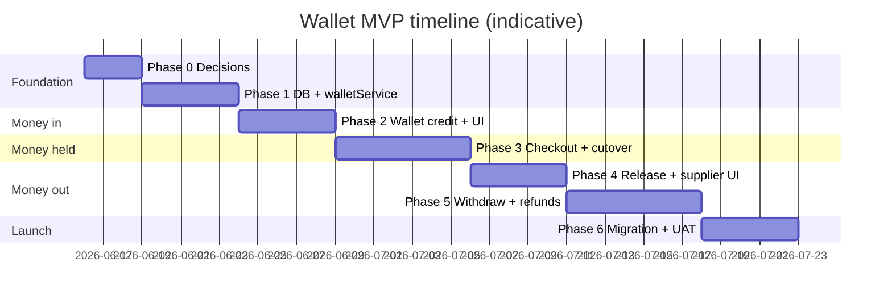
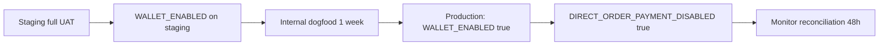

# Wallet System — Implementation Plan

**Status:** Planning (pre-implementation)  
**Companion doc:** [WALLET_SYSTEM_GUIDE.md](./WALLET_SYSTEM_GUIDE.md) (product + technical spec)  
**Last updated:** 2026-06-15

**Platform fees:** Admin-defined **dynamically per supply chain level** (brand × role: manufacturer → retailer), not a single flat % for everyone. See guide §4 and §7.

This document is the **execution plan** for building the platform-middleman wallet system.

---

## Table of contents

1. [Goals and non-goals](#1-goals-and-non-goals)
2. [Pre-implementation checklist](#2-pre-implementation-checklist)
3. [High-level timeline](#3-high-level-timeline)
4. [Phase 0 — Decisions and setup](#4-phase-0--decisions-and-setup)
5. [Phase 1 — Data layer and wallet core](#5-phase-1--data-layer-and-wallet-core)
6. [Phase 2 — Wallet credit (money in)](#6-phase-2--wallet-credit-money-in)
7. [Phase 3 — Wallet checkout (money held)](#7-phase-3--wallet-checkout-money-held)
8. [Phase 4 — Supplier release (money out to supplier wallet)](#8-phase-4--supplier-release-money-out-to-supplier-wallet)
9. [Phase 5 — Withdrawals, refunds, admin](#9-phase-5--withdrawals-refunds-admin)
10. [Phase 6 — Legacy migration and hard cutover](#10-phase-6--legacy-migration-and-hard-cutover)
11. [Phase 7 — Automation (post-MVP)](#11-phase-7--automation-post-mvp)
12. [Feature flags and rollout](#12-feature-flags-and-rollout)
13. [Files to create and modify](#13-files-to-create-and-modify)
14. [Testing strategy](#14-testing-strategy)
15. [Risk register](#15-risk-register)
16. [Definition of done (MVP)](#16-definition-of-done-mvp)
17. [Go / no-go before production](#17-go--no-go-before-production)

---

## 1. Goals and non-goals

### Goals (MVP)

- Platform is the **only** payment middleman — no direct customer → supplier settlement.
- Customer funds a **wallet**, pays orders **from wallet only**.
- Full order amount moves to **platform escrow** on payment.
- **Platform fee** is calculated from **admin-defined rules per supply chain role** (and per brand + role), then snapshotted on each order.
- On delivery, **net amount** credits **supplier wallet**; fee credits **platform revenue**.
- Supplier can **request withdrawal**; admin approves (manual bank transfer for MVP).
- All wallet movements are **auditable** (immutable `wallet_transactions` + `audit_log_entries`).
- Legacy direct-payment APIs are **disabled** behind feature flags before public cutover.

### Non-goals (MVP — defer to Phase 7+)

- Razorpay Payouts / Route for automatic supplier bank transfer
- POS walk-in customer wallet linked by phone (unless POS is in scope for launch)
- Full migration of historical paid orders into wallet ledger
- Multi-currency wallets
- Negative wallet balance / complex credit scoring (start with prepaid wallet only if possible)

---

## 2. Pre-implementation checklist

Do **not** start Phase 1 code until these are checked off.

### Business (product owner)

- [ ] Fee matrix draft: % or fixed per **supply chain role** (manufacturer … retailer)
- [ ] Per-brand fee overrides needed? (e.g. Philips dealer 3.5%, generic dealer 4%)
- [ ] Multi-brand order rule: fee per line item, summed (recommended)
- [ ] Release trigger agreed: `delivered` status vs admin approval vs T+N days
- [ ] Refund policy: always back to customer wallet vs bank for wallet credits
- [ ] Minimum wallet credit and minimum withdrawal amounts
- [ ] Pay-later: migrate to platform credit limit **or** disable at launch
- [ ] POS in scope for launch? If yes, cash/UPI → wallet credit flow approved
- [ ] Wallet T&C draft (platform store credit, not a bank account)

### Technical (engineering lead)

- [ ] SQL migration path agreed (`backend/sql/migration_wallet_system.sql`)
- [ ] Feature flag strategy agreed (`WALLET_ENABLED`, `DIRECT_ORDER_PAYMENT_DISABLED`)
- [ ] Staging Razorpay keys available for wallet credit testing
- [ ] Rollback plan: can turn off wallet and re-enable direct pay in emergency (document steps)
- [ ] Existing `payment_transactions` / reconciliation impact reviewed

### Operations / finance

- [ ] Platform bank account for manual bank-transfer wallet credits
- [ ] Process for admin to verify bank transfers and credit wallets
- [ ] Process for supplier withdrawal approval and NEFT reference logging
- [ ] GST treatment on platform fee clarified with CA

---

## 3. High-level timeline

Estimated **6–8 weeks** for MVP with one full-stack developer; can parallelize backend/frontend in places.



| Phase | Duration | Outcome |
|-------|----------|---------|
| 0 | 2–3 days | Decisions locked, env ready |
| 1 | 1 week | Wallets exist; credit/debit works in tests |
| 2 | 1 week | Users can credit wallet via Razorpay; balance visible |
| 3 | 1–1.5 weeks | Orders paid only via wallet; direct APIs gated |
| 4 | 1 week | Delivery triggers supplier wallet credit |
| 5 | 1–1.5 weeks | Withdrawals, refunds, admin dashboards |
| 6 | 1 week | Legacy paths off, UAT passed, staged rollout |

---

## 4. Phase 0 — Decisions and setup

**Objective:** Lock configuration and scaffolding so later phases do not rework fundamentals.

### Tasks

| # | Task | Owner | Output |
|---|------|-------|--------|
| 0.1 | Fill [business rules](./WALLET_SYSTEM_GUIDE.md#4-business-rules-to-decide-first) in guide | Product | Signed-off fee %, release rule, limits |
| 0.2 | Add env vars to `.env.example` | Backend | `WALLET_ENABLED`, `DIRECT_ORDER_PAYMENT_DISABLED`, fee defaults |
| 0.3 | Create `backend/contracts/walletContracts.js` (Zod schemas) | Backend | Request/response validation |
| 0.4 | Create empty `backend/routes/wallet.js` + register in `api.js` | Backend | Route skeleton behind `WALLET_ENABLED` |
| 0.5 | Add `docs/WALLET_UAT_CHECKLIST.md` copy from guide §18 | QA | Test script ready |
| 0.6 | Announce internal freeze on new direct-payment features | Team | No new Razorpay-on-order work |

### Exit criteria

- [ ] Fee % and release trigger written in this doc or guide
- [ ] Feature flags documented
- [ ] No open product blockers

---

## 5. Phase 1 — Data layer and wallet core

**Objective:** Database tables and a safe `walletService` with no UI yet.

### 5.1 Database migration

**File:** `backend/sql/migration_wallet_system.sql`

Create tables (see guide §7):

- `wallets`
- `wallet_transactions`
- `supply_chain_platform_fees` (admin-managed brand × role matrix)
- `supplier_payouts`
- `wallet_topups`
- Alter `orders`: `platform_fee_amount`, `supplier_payout_amount`, `wallet_payment_status`, `supply_chain_role_at_payment`, `platform_fee_breakdown`

Seed data:

- One `platform_escrow` wallet (no `user_id`)
- One `platform_revenue` wallet
- **Global role defaults** in `supply_chain_platform_fees` (one row per role, `brand_name NULL`), e.g.:

| supply_chain_role | fee_type | fee_value |
|-------------------|----------|-----------|
| manufacturer | percentage | 1.5 |
| stockist | percentage | 2.0 |
| regional_distributor | percentage | 2.5 |
| local_distributor | percentage | 3.0 |
| dealer | percentage | 4.0 |
| retailer | percentage | 5.0 |

(Values are examples — admin edits via UI.)

Run migration on **local → staging** before any app code depends on it.

### 5.2 Core service

**File:** `backend/services/walletService.js`

| Function | Priority | Notes |
|----------|----------|-------|
| `getOrCreateWallet` | P0 | Lazy create customer/supplier/platform wallets |
| `getWalletBalance` | P0 | |
| `creditWallet` | P0 | Idempotency key required |
| `debitWallet` | P0 | Fail if insufficient balance |
| `transferBetweenWallets` | P0 | Atomic pair in one DB transaction |
| `listWalletTransactions` | P1 | Paginated |

**File:** `backend/services/platformFeeService.js`

| Function | Priority |
|----------|----------|
| `resolveFeeRule({ brandName, supplyChainRole, supplierId })` | P0 |
| `getSupplierRoleForBrand(supplierId, brandName)` | P0 — reuse chain profile / `supplierChainRoutingService` |
| `calculateLinePlatformFee(...)` | P0 |
| `calculateOrderPlatformFee(order)` | P0 |
| `snapshotFeeOnOrder(order)` | P0 |

**File:** `backend/repositories/supplyChainPlatformFeesRepository.js` — CRUD for admin fee matrix

### 5.3 Concurrency approach

Choose one and implement in Phase 1:

**Option A (recommended):** Supabase RPC `wallet_transfer` in PostgreSQL with `SELECT ... FOR UPDATE` on wallet row.

**Option B:** Application-level transaction with retry on conflict.

Document choice in `walletService.js` header comment.

### 5.4 Minimal read APIs

| Endpoint | Auth |
|----------|------|
| `GET /api/wallet/balance` | Service provider |
| `GET /api/wallet/transactions` | Service provider |

### 5.5 Tests (Phase 1)

**File:** `backend/tests/walletService.test.js`

- Credit increases balance
- Debit fails on insufficient funds
- Idempotent credit does not double
- Transfer debits source and credits destination atomically
- Fee resolution: brand+role beats role-only beats env fallback
- Philips + dealer 3.5% on ₹10,000 line → ₹350 fee
- Order with 2 brands sums line fees correctly

### Exit criteria

- [ ] Migration applied on staging
- [ ] All Phase 1 tests green
- [ ] Manual API test: create wallet, credit ₹100, debit ₹30, balance ₹70
- [ ] Platform escrow + revenue wallets exist

---

## 6. Phase 2 — Wallet credit (money in)

**Objective:** Customer can add money via Razorpay; money never touches an order directly.

### 6.1 Backend

| # | Task | Files |
|---|------|-------|
| 2.1 | `POST /api/wallet/topup/create` | `walletController.js`, reuse `razorpayService.js` |
| 2.2 | `POST /api/wallet/topup/confirm` | Signature verify like payments confirm |
| 2.3 | Extend Razorpay webhook | `razorpayWebhookRouter.js` — only `notes.purpose === 'wallet_topup'` |
| 2.4 | Insert `wallet_topups` row; on success `creditWallet` | `walletTopupService.js` |
| 2.5 | Ledger: Cash/Bank → Customer Wallet Liability | `ledgerService.js` |

**Razorpay order notes must include:**

```json
{ "purpose": "wallet_topup", "walletId": "...", "userId": "..." }
```

**Do not** create Razorpay orders with `orderId` in notes for checkout anymore.

### 6.2 Frontend

| # | Task | Files |
|---|------|-------|
| 2.6 | Wallet page: balance + transaction list | `frontend/src/pages/Wallet.jsx` |
| 2.7 | Wallet credit modal with Razorpay checkout | component + API hooks |
| 2.8 | Nav link for service providers | dashboard layout |

### 6.3 Admin (optional in Phase 2)

| # | Task |
|---|------|
| 2.9 | `POST /api/admin/wallet/topup/manual` — admin credits wallet (cash/bank received offline) with audit log |

### Exit criteria

- [ ] Wallet credit ₹500 on staging → balance +₹500
- [ ] Duplicate webhook does not double-credit
- [ ] `wallet_topups` reconciles with Razorpay dashboard
- [ ] User can view transaction history

---

## 7. Phase 3 — Wallet checkout (money held)

**Objective:** The **only** path to `payment_status = paid` is wallet debit → escrow credit.

### 7.1 Backend — pay order

**File:** `backend/services/walletOrderPaymentService.js`

Flow for `POST /api/wallet/orders/:id/pay`:

1. Load order; authorize `service_provider_id === req.userId`
2. Reject if already `paid`
3. `gross = order.total_amount`
4. `platformFee = calculateOrderPlatformFee(order)` — **per line item by brand + supplier role**
5. `supplierNet = gross - platformFee`
6. Snapshot `platform_fee_breakdown`, `supply_chain_role_at_payment` on order
7. `debitWallet(customerWallet, gross)`
8. `creditWallet(platformEscrow, gross)`
9. Insert `supplier_payouts` (`pending`)
10. Update order: `payment_status=paid`, `payment_method=wallet`, fee columns, `wallet_payment_status=held`
11. Call existing hooks: `ensurePaymentTransactionForPaidOrder`, `createReceiptAndDeliver`, `createInvoiceForOrder`
12. Ledger: Customer Wallet Liability → Platform Escrow
13. Notify supplier with **net** amount only

### 7.2 Disable direct payment rails

| # | Task | File |
|---|------|------|
| 3.1 | Return `410` or `403` when `DIRECT_ORDER_PAYMENT_DISABLED=true` | `paymentsController.js` |
| 3.2 | Webhook: ignore order-payment captures (log warning) | `razorpayWebhookRouter.js` |
| 3.3 | Block non-admin `PATCH .../payment` mark-paid | `dashboard/paymentRoutes.js` |
| 3.4 | Central guard: `assertOrderPaidViaWallet(orderId)` in reconciliation | new helper |

### 7.3 Frontend — checkout cutover

| # | Task | File |
|---|------|------|
| 3.5 | Remove online/COD/bank/credit from checkout | `CreatePO.jsx` |
| 3.6 | Replace Razorpay order pay with wallet pay | `YourOrders.jsx` |
| 3.7 | Show balance, shortfall, inline credit CTA | checkout components |
| 3.8 | Inline wallet credit then auto-call pay (two API calls, one UX) | |
| 3.9 | **Admin fee matrix UI** — brand × supply chain role | extend `AdminSupplyChain.jsx` or `AdminPlatformFees.jsx` |
| 3.10 | `PUT /api/admin/supply-chain/platform-fees` | `adminSupplyChainController.js` or new controller |

| 3.11 | Receipt: “Paid to [Platform] from wallet” | `paymentReceiptService.js` |
| 3.12 | Show platform fee + role used on receipt/invoice | optional line items from `platform_fee_breakdown` |

### Exit criteria

- [ ] Cannot pay order via old Razorpay endpoints when flag on
- [ ] Wallet pay marks order paid; escrow balance increases
- [ ] Admin can set fee for dealer vs stockist independently
- [ ] Admin can override fee for Philips + dealer
- [ ] Wallet pay uses correct fee for supplier’s chain role
- [ ] `platform_fee_breakdown` stored on order
- [ ] Receipt + invoice still generated
- [ ] Reconciliation flags any `paid` order without wallet rows

---

## 8. Phase 4 — Supplier release (money out to supplier wallet)

**Objective:** On delivery, escrow releases net to supplier wallet and fee to platform revenue.

### 8.1 Backend

**File:** `backend/services/supplierPayoutService.js`

| Function | Trigger |
|----------|---------|
| `releaseSupplierPayout(orderId)` | Order `status → delivered` |
| `getPendingPayouts(supplierId)` | Supplier dashboard |

`releaseSupplierPayout` steps:

1. Load `supplier_payouts` where `status = pending`
2. `transferBetweenWallets(escrow → supplierWallet, supplierNet)`
3. `transferBetweenWallets(escrow → platformRevenue, platformFee)`
4. Update payout `released`, order `wallet_payment_status = released`
5. Ledger entries
6. Notification to supplier

**Hook locations** (find and patch):

- Supplier order status update routes
- Admin order status update
- Any `delivered` transition in `orderDetailRoutes.js` / `supplier/orderRoutes.js`

### 8.2 Frontend

| # | Task | File |
|---|------|------|
| 4.1 | Supplier wallet page: balance, pending vs released | `SupplierWallet.jsx` |
| 4.2 | Order detail: show fee, net, payout status | supplier order views |

### Exit criteria

- [ ] Deliver order → supplier wallet +net, platform revenue +fee
- [ ] Cannot release twice (idempotent)
- [ ] Escrow balance decreases correctly
- [ ] Supplier notification shows net amount

---

## 9. Phase 5 — Withdrawals, refunds, admin

**Objective:** Complete the loop — supplier gets money to bank; cancelled orders refund to wallet; admin has visibility.

### 9.1 Supplier withdrawals (manual MVP)

| Endpoint | Description |
|----------|-------------|
| `POST /api/supplier/wallet/withdraw` | Request withdrawal |
| `GET /api/admin/wallet/withdrawals` | Queue |
| `PATCH /api/admin/wallet/withdrawals/:id/approve` | Record bank ref, debit supplier wallet |

Table: `wallet_withdrawals` (add in migration or Phase 5 patch)

### 9.2 Refunds

**File:** `backend/services/walletRefundService.js`

On order cancel **before** payout released:

- Debit escrow `gross` → credit customer wallet `gross`
- Cancel `supplier_payouts`
- `wallet_payment_status = refunded`, `payment_status = refunded`

### 9.3 Admin dashboards

Extend `AdminTransactions.jsx` or new `AdminWallet.jsx`:

- Total escrow held
- Platform revenue (fees) by period
- Pending supplier payouts
- Pending withdrawals

### 9.4 Reconciliation

Extend `reconciliationService.js`:

- Wallet-specific run type `wallet`
- Checks from guide §13

### Exit criteria

- [ ] Supplier withdrawal flow works end-to-end on staging
- [ ] Cancel held order refunds customer wallet
- [ ] Admin dashboard shows escrow and fees
- [ ] Wallet reconciliation run passes with 0 open issues

---

## 10. Phase 6 — Legacy migration and hard cutover

**Objective:** Safely turn off direct payments in production.

### 10.1 Data migration (existing users)

| # | Task | Notes |
|---|------|-------|
| 6.1 | Create customer wallet for every active service provider | Script: `backend/scripts/seedCustomerWallets.js` |
| 6.2 | Create supplier wallet for every active supplier | Same script |
| 6.3 | **Do not** backfill historical orders into escrow | Optional reporting-only |
| 6.4 | Communicate to users: new wallet flow, credit wallet before order | Email / in-app banner |

### 10.2 POS and credit (if in scope)

| Area | Action |
|------|--------|
| `posController.js` | Cash/UPI → wallet credit → `walletOrderPay` |
| `SupplierPOS.jsx` | Two-step UX or single “Complete sale” calling both APIs |
| `creditAccountService.js` | Disable at launch **or** wrap as platform wallet credit limit (Phase 7) |

### 10.3 Rollout sequence



1. Deploy with `WALLET_ENABLED=false` (no user impact)
2. Enable on staging; run UAT checklist
3. Production: `WALLET_ENABLED=true` — wallet visible, wallet credit works, **direct pay still works** (soft launch)
4. After validation: `DIRECT_ORDER_PAYMENT_DISABLED=true` — hard cutover
5. Monitor reconciliation and support tickets 48 hours

### Exit criteria

- [ ] All service providers have wallets
- [ ] UAT checklist 100% pass on staging
- [ ] Rollback procedure tested
- [ ] Direct payment disabled in production
- [ ] Zero reconciliation issues for wallet run

---

## 11. Phase 7 — Automation (post-MVP)

Defer until MVP is stable in production.

- [ ] Razorpay Payouts for supplier bank transfer
- [ ] Auto-release after N days if no dispute
- [ ] Platform wallet credit line (migrate `creditAccountService.js`)
- [ ] POS customer wallet by phone
- [ ] Voice commerce checkout via wallet (`voiceTools.js`)

---

## 12. Feature flags and rollout

| Variable | Default (dev) | Production rollout |
|----------|---------------|-------------------|
| `WALLET_ENABLED` | `true` | `true` when wallet UI + APIs ready |
| `DIRECT_ORDER_PAYMENT_DISABLED` | `false` | `true` only after Phase 3 UAT pass |
| `PLATFORM_FEE_PERCENT_DEFAULT` | `5` | **Fallback only** when no supply-chain rule matches |
| `WALLET_MIN_TOPUP_INR` | `100` | Product decision |
| `SUPPLIER_MIN_WITHDRAWAL_INR` | `500` | Product decision |

**Guard pattern** (use everywhere):

```js
if (process.env.DIRECT_ORDER_PAYMENT_DISABLED === 'true') {
  return res.status(410).json({ code: 'DIRECT_PAYMENT_DISABLED', message: '...' });
}
```

---

## 13. Files to create and modify

### New files

| Path | Phase |
|------|-------|
| `backend/sql/migration_wallet_system.sql` | 1 |
| `backend/services/walletService.js` | 1 |
| `backend/repositories/supplyChainPlatformFeesRepository.js` | 1 |
| `backend/controllers/adminPlatformFeesController.js` | 3 |
| `backend/services/platformFeeService.js` | 1 |
| `backend/services/walletTopupService.js` | 2 |
| `backend/services/walletOrderPaymentService.js` | 3 |
| `backend/services/supplierPayoutService.js` | 4 |
| `backend/services/walletRefundService.js` | 5 |
| `backend/controllers/walletController.js` | 2 |
| `backend/controllers/walletAdminController.js` | 5 |
| `backend/contracts/walletContracts.js` | 0 |
| `backend/routes/wallet.js` | 0 |
| `backend/tests/walletService.test.js` | 1 |
| `backend/tests/walletOrderPayment.test.js` | 3 |
| `backend/scripts/seedCustomerWallets.js` | 6 |
| `frontend/src/pages/Wallet.jsx` | 2 |
| `frontend/src/pages/SupplierWallet.jsx` | 4 |
| `frontend/src/pages/AdminWallet.jsx` | 5 |
| `frontend/src/pages/AdminPlatformFees.jsx` | 3 — or tab in `AdminSupplyChain.jsx` |

### Modify (critical path)

| Path | Phase | Change |
|------|-------|--------|
| `backend/routes/api.js` | 0 | `apiRouter.use('/wallet', walletRouter)` |
| `backend/controllers/paymentsController.js` | 3 | Gate direct Razorpay-on-order |
| `backend/controllers/payments/razorpayWebhookRouter.js` | 2–3 | Wallet credit only |
| `backend/controllers/dashboard/paymentRoutes.js` | 3 | Block mark-paid bypass |
| `backend/controllers/posController.js` | 6 | Wallet two-step |
| `backend/services/ledgerService.js` | 2–5 | Wallet account names |
| `backend/services/reconciliationService.js` | 5 | Wallet checks |
| `backend/services/paymentReceiptService.js` | 3 | Platform payee wording |
| `frontend/src/pages/CreatePO.jsx` | 3 | Wallet-only checkout |
| `frontend/src/pages/YourOrders.jsx` | 3 | Wallet pay |
| `backend/controllers/adminSupplyChainController.js` | 3 | Platform fee matrix APIs |
| `frontend/src/pages/AdminSupplyChain.jsx` | 3 | Fee % per role / per brand+role |
| `frontend/src/pages/SupplierPOS.jsx` | 6 | Wallet credit + pay |

---

## 14. Testing strategy

### Unit tests (each phase)

- `walletService` — balance, idempotency, insufficient funds
- `platformFeeService` — role-based, brand+role override, multi-line sum, env fallback
- `walletOrderPaymentService` — happy path, double-pay rejected
- `supplierPayoutService` — release once, correct split

### Integration tests

- Wallet credit create → webhook → balance increased
- Pay order → escrow increased → payout pending
- Deliver → supplier wallet increased
- Cancel → customer refunded

### Manual UAT

Use [WALLET_SYSTEM_GUIDE.md §18](./WALLET_SYSTEM_GUIDE.md#18-uat-checklist) plus:

- [ ] Full journey: register → wallet credit → place order → pay → deliver → supplier sees balance
- [ ] Attempt every old direct-payment path → all blocked

### Regression

- Existing `backend/tests/paymentsRoutes.test.js` — update for gated endpoints
- Run full backend test suite before each phase merge

---

## 15. Risk register

| Risk | Impact | Mitigation |
|------|--------|------------|
| Double credit on webhook retry | High | Idempotency keys on `wallet_topups` and `wallet_transactions` |
| Race on concurrent wallet debits | High | DB row lock or RPC |
| Users blocked at checkout (no balance) | Medium | Clear UX + inline wallet credit; comms before cutover |
| Supplier upset about fee / delayed payout | Medium | Show fee upfront; release SLA in T&C |
| Legacy POS bypasses wallet | High | Phase 6 POS refactor before cutover |
| Regulatory (holding funds) | Medium | Virtual ledger MVP; legal review; manual payouts |
| Broken reconciliation after cutover | High | Wallet reconciliation run in CI/staging; 48h watch |
| Credit account migration complexity | Medium | Disable pay-later at launch or Phase 7 |

---

## 16. Definition of done (MVP)

MVP is complete when **all** are true:

1. Customer can credit wallet and pay orders **only** from wallet.
2. Direct order payment APIs return disabled in production.
3. Every paid order has escrow hold and `supplier_payouts` row.
4. Delivery releases net to supplier wallet; platform fee recorded.
5. Supplier can request withdrawal; admin can approve.
6. Cancelled (pre-release) orders refund to customer wallet.
7. Admin sees escrow, fees, and withdrawal queue.
8. Wallet reconciliation run passes with no open high-severity issues.
9. UAT checklist signed off.
10. User-facing wallet T&C published.

---

## 17. Go / no-go before production

### Go

- [ ] Phases 1–5 complete on staging
- [ ] Phase 6 seed script run on staging
- [ ] Product + finance sign-off on fee and release rules
- [ ] Rollback tested (`DIRECT_ORDER_PAYMENT_DISABLED=false` restores old path if needed)
- [ ] Support team briefed on wallet FAQs

### No-go (block launch)

- Any paid order without matching wallet/escrow transactions
- Double-credit bug open
- POS still marking orders paid without wallet (if POS in scope)
- Reconciliation failure rate > 0 on staging wallet run
- No withdrawal approval process for finance team

---

## Recommended start order (this week)

If you are ready to code, do **only** this next:

1. **Phase 0** — Draft fee matrix per supply chain role (and which brands need overrides).
2. **Phase 1** — Write `migration_wallet_system.sql` + `walletService.js` + `platformFeeService.js` + unit tests.
3. **Do not** touch checkout UI until Phase 2 wallet credit works on staging.

This keeps risk low: you validate money movement in the backend before changing user-facing payment flows.

---

## Document map

| Document | Purpose |
|----------|---------|
| [WALLET_SYSTEM_GUIDE.md](./WALLET_SYSTEM_GUIDE.md) | What to build (spec, schema, APIs, flows) |
| **WALLET_IMPLEMENTATION_PLAN.md** (this file) | How to build it (phases, tasks, rollout) |
| `backend/sql/PHASE3_PAYMENTS_ROLLOUT.md` | Existing Razorpay setup (reuse for wallet credit only) |

---

*Update this plan at the end of each phase with actual dates and any scope changes.*
