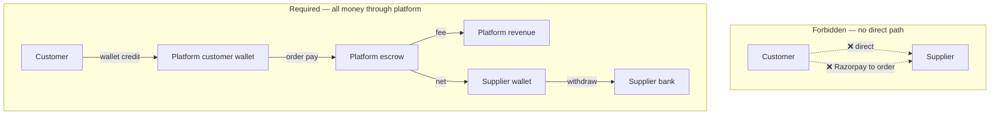
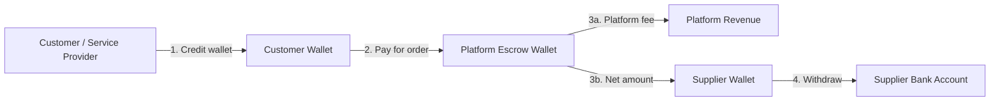
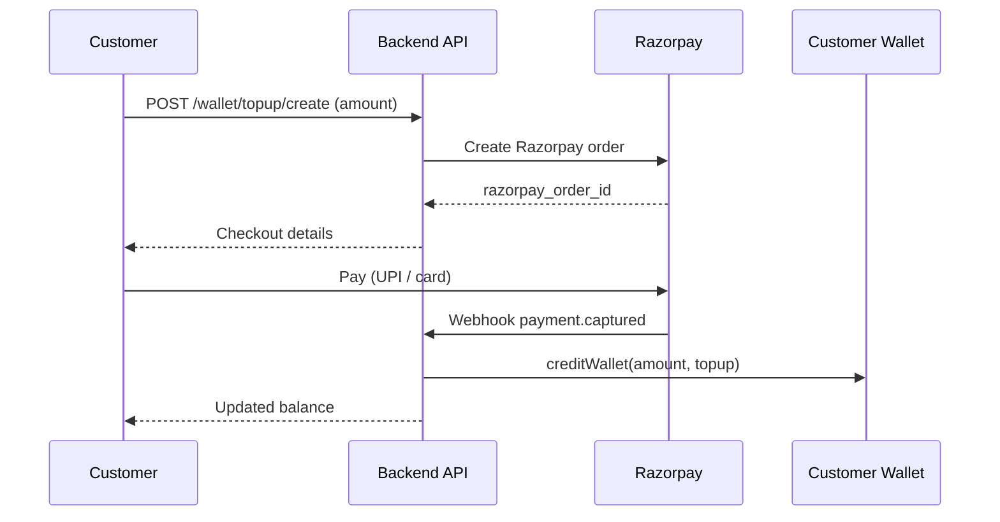
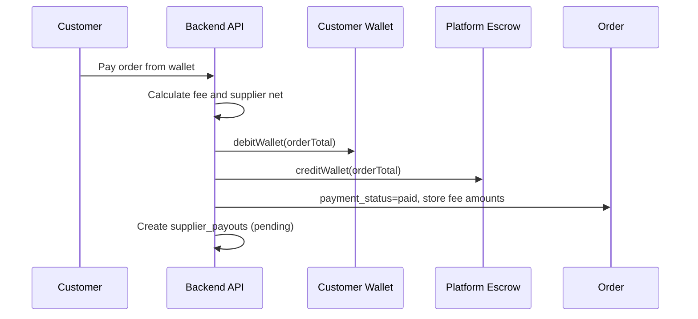
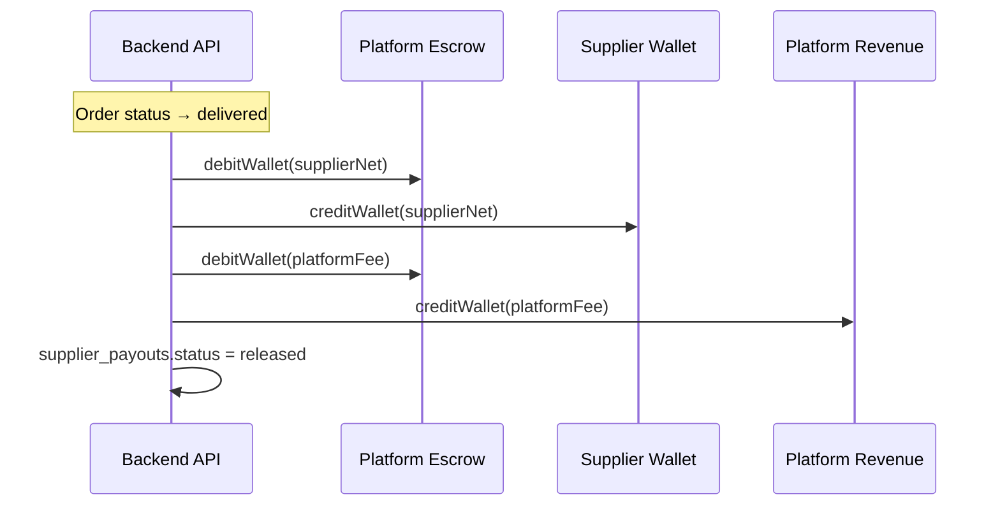

# Wallet System Guide — Customer Pay-In, Platform Fee, Supplier Payout

This document describes how to add a **wallet-based payment model** to the Tatva platform:

1. **Customer** (service provider / buyer) pays **into a wallet** first.
2. **Order payment** is debited from the customer wallet.
3. Money is **held in platform escrow** until the order is complete.
4. **Platform takes a commission** (fee) from the order amount.
5. **Supplier receives the net amount** (order total − platform fee) in their wallet.
6. Supplier **withdraws** to their bank account (manual or automated).

Use this as the product spec, technical design, and phased implementation checklist.

**Execution plan:** [WALLET_IMPLEMENTATION_PLAN.md](./WALLET_IMPLEMENTATION_PLAN.md) — phases, tasks, rollout, and go/no-go before coding.

### Core policy: platform is the only payment middleman

**There are no direct payment methods.** Customers never pay suppliers directly, and Razorpay never settles an order in one hop. Every rupee follows:

**Customer → Platform (wallet credit) → Platform escrow → Supplier wallet (net) + Platform fee**

Cash, UPI, card, bank transfer, and pay-later are only **ways to fund the customer wallet** (or platform-recorded equivalents). Order checkout is **wallet-only**.

---

## Table of contents

1. [Big picture](#1-big-picture)
2. [Platform-as-middleman model](#2-platform-as-middleman-model)
3. [Current state vs target](#3-current-state-vs-target)
4. [Business rules to decide first](#4-business-rules-to-decide-first)
5. [Wallet types](#5-wallet-types)
6. [Money flow diagrams](#6-money-flow-diagrams)
7. [Database design](#7-database-design)
8. [Backend services](#8-backend-services)
9. [API endpoints](#9-api-endpoints)
10. [Step-by-step flows](#10-step-by-step-flows)
11. [Frontend screens](#11-frontend-screens)
12. [Integration with existing code](#12-integration-with-existing-code)
13. [Ledger and reconciliation](#13-ledger-and-reconciliation)
14. [Edge cases](#14-edge-cases)
15. [Phased build order](#15-phased-build-order)
16. [Legal and compliance (India)](#16-legal-and-compliance-india)
17. [Environment and configuration](#17-environment-and-configuration)
18. [UAT checklist](#18-uat-checklist)
19. [Related files in this repo](#19-related-files-in-this-repo)

---

## 1. Big picture

### One-line summary

**Customer loads wallet → pays order (full amount leaves wallet) → platform holds money in escrow → on delivery, supplier wallet receives (total − platform fee) → supplier withdraws to bank.**

### Example

| Step | Amount | Who |
|------|--------|-----|
| Customer tops up wallet | +₹5,000 | Customer wallet |
| Customer pays for order | −₹1,000 | Customer wallet |
| Money held in escrow | +₹1,000 | Platform escrow |
| Platform fee (5%) | ₹50 kept by platform | Platform revenue |
| Supplier payout (on delivery) | +₹950 | Supplier wallet |
| Supplier withdraws | −₹950 | Supplier bank account |

### Roles

| Role | Wallet? | Action |
|------|---------|--------|
| Service provider (buyer) | Yes — customer wallet | Credit wallet, pay for orders |
| Supplier | Yes — supplier wallet | Receive net payout, withdraw |
| Platform (admin) | Escrow + revenue wallets | Hold funds, collect fee, approve withdrawals |
| POS walk-in customer | Optional (Phase 2+) | Wallet funded at counter; order still debits wallet |

---

## 2. Platform-as-middleman model

This is the **non-negotiable** payment architecture. The platform always sits between customer and supplier.

### What is allowed

| Action | Allowed? | Notes |
|--------|----------|-------|
| Customer tops up wallet via Razorpay (UPI / card) | Yes | Money lands with **platform**; customer wallet credited |
| Customer pays for order **from wallet only** | Yes | Debit customer wallet → credit platform escrow |
| Platform releases net amount to supplier wallet | Yes | After delivery (or policy trigger) |
| Supplier withdraws from supplier wallet to bank | Yes | Platform initiates or approves payout |
| Platform keeps commission on every order | Yes | Deducted before supplier receives net |

### What is NOT allowed (must be removed or disabled)

| Action | Why it breaks the model |
|--------|-------------------------|
| Razorpay checkout **linked directly to an order** | Bypasses wallet and escrow; supplier could be implied as payee |
| Service provider marks order paid without wallet debit | No funds held by platform; no fee capture |
| Supplier marks “payment received” for full order amount | Same as above — direct settlement |
| COD where customer pays supplier at delivery | Supplier receives money outside platform |
| Bank transfer reference pasted on order without wallet credit | No platform custody |
| Credit / pay-later that books revenue without wallet escrow | Must become **wallet credit line** owned by platform, not supplier |
| POS cash/UPI recorded as `payment_status = paid` without wallet | Must **credit customer wallet first**, then debit for order |

### Two-step rule (always)

Every order payment is **two steps**, never one:

1. **Fund** — Customer wallet receives money (Razorpay wallet credit, admin-recorded cash, approved credit limit, etc.).
2. **Spend** — Checkout debits customer wallet and credits platform escrow.

Razorpay (and any external gateway) is a **wallet credit rail only**, not an order checkout rail.

### How “payment methods” map in the new world

Old UI labels become **wallet funding channels**, not checkout methods:

| Old checkout method | New behavior |
|---------------------|--------------|
| Online (Razorpay) | Credit wallet → pay order from wallet |
| UPI / card | Credit wallet → pay order from wallet |
| Bank transfer | Customer transfers to **platform bank account** → admin verifies → wallet credited |
| Cash (POS) | Staff collects cash → platform records wallet credit → wallet credited → order paid from wallet |
| Credit / pay later | Platform extends **wallet credit limit** → order debits wallet (negative balance or reserved limit) → settlement pays down limit later |

Checkout screen shows **one option only: “Pay from wallet”** (with balance and additional credit if needed).

### Supplier never sees customer payment details

- Supplier does not receive Razorpay/UPI money directly.
- Supplier sees: order amount, platform fee, **net payout**, and payout status (pending / released / withdrawn).
- Customer receipt shows payment to **platform**; supplier statement shows earnings from **platform**.

### Diagram: platform in the middle



---

## 3. Current state vs target

### What exists today

| Component | Location | Current behavior |
|-----------|----------|------------------|
| Orders | `orders` table | `total_amount`, `payment_status`, `payment_method` |
| Online payments | `backend/controllers/paymentsController.js` | Razorpay pays order directly |
| Webhooks | `backend/controllers/payments/razorpayWebhookRouter.js` | Marks order `paid` on capture |
| Payment transactions | `payment_transactions` table | Records captured payments |
| Receipts & invoices | `paymentReceiptService.js`, `invoiceService.js` | Created when order is paid |
| Ledger | `backend/services/ledgerService.js` | Cash/Bank ↔ Accounts Receivable |
| Credit / pay later | `creditAccountService.js` | Supplier-side credit accounts |
| Reconciliation | `reconciliationService.js` | Settlement report from payment txns |
| Supplier notification | `dashboard/paymentRoutes.js` | Notified for **full** `total_amount` |

### What is missing

- Per-user **wallet balances**
- Immutable **wallet transaction** history
- **Platform fee** calculation and storage on orders
- **Escrow hold** between payment and delivery
- **Supplier payout** workflow (net amount after fee)
- **Withdrawal** from supplier wallet to bank
- **Wallet** as a `payment_method` in checkout UI

### Target state

| Event | Old flow | New flow (platform middleman) |
|-------|----------|-------------------------------|
| Customer pays | Razorpay → order `paid` directly | Wallet credit → wallet debit → escrow → order `paid` |
| Supplier notified | Full order amount | Net amount only; fee shown separately |
| Money movement | Direct (logical) | Always: escrow → supplier wallet on delivery |
| Platform revenue | Not tracked per order | `platform_fee_amount` on every order |
| Accounting | AR / Cash only | Wallet liability + escrow + payables |
| Checkout methods | Many (online, COD, credit, …) | **Wallet only** at checkout |

### APIs and UI to retire or gate

| Current | Action |
|---------|--------|
| `POST /api/payments/orders/:id/razorpay/create` | **Remove or return 410** — replace with wallet credit + wallet pay |
| `POST /api/payments/orders/:id/razorpay/confirm` | **Remove or return 410** |
| `PATCH .../orders/:id/payment` (mark paid without wallet) | **Admin-only** with audit, or remove for non-admin |
| `POST /api/payments/orders/:id/bank-transfer/mark` | Move to **wallet credit verification**, not order paid |
| `POST /api/payments/orders/:id/credit-line/approve` | Refactor to **platform wallet credit limit**, then wallet pay |
| Checkout: online / COD / bank / credit options | **Remove** — show wallet balance + credit action only |
| POS: cash/UPI → order `paid` | **Change** to cash/UPI → wallet credit → wallet pay |

---

## 4. Business rules to decide first

Answer these **before writing code**. Document decisions in this section or a linked policy doc.

### Wallet ownership

- [ ] Who gets a customer wallet? (Service providers only? POS customers too?)
- [ ] One wallet per user, or separate wallets per supplier relationship?
- [ ] Minimum wallet credit amount? (e.g. ₹100)
- [ ] Maximum wallet balance? (optional cap)

### When money moves

- [ ] **Debit customer wallet:** at order placement, payment confirmation, or both?
- [ ] **Release to supplier:** on `delivered` status, admin approval, or fixed delay (e.g. T+2)?
- [ ] **Platform fee:** deducted at payment time or at release time? (Recommend: calculate at payment, move at release)

### Platform fee (admin-defined per supply chain level)

Fees are **dynamic** and configured by **admin** — not a single hardcoded % for everyone.

They align with your existing supply chain model:

| Concept | Existing in repo |
|---------|------------------|
| Chain roles | `manufacturer` → `stockist` → `regional_distributor` → `local_distributor` → `dealer` → `retailer` (`supplyChainSharedService.js`) |
| Admin chain definitions | `category_supply_chains` + `AdminSupplyChain.jsx` (per brand) |
| Supplier’s role on order | Supplier profile `supplierRole` per brand (`supplierChainRoutingService.js`) |

**Admin configures fee per:**

1. **Supply chain role** (global default per level) — e.g. dealer 4%, stockist 2%
2. **Brand + supply chain role** (most specific) — e.g. Philips + dealer 3.5%
3. **Optional supplier override** — edge cases only; role-based rules are primary

**At order payment**, backend resolves:

```
brand (from order items) + supplier’s chain role → fee rule → platform_fee_amount
```

Fee is **snapshotted on the order** at payment time (immutable if admin changes rules later).

- [ ] Fee type per rule: **percentage** or **fixed per order**
- [ ] Multi-brand orders: fee per line item, summed to order total fee
- [ ] Fallback if no rule matches: `PLATFORM_FEE_PERCENT_DEFAULT` env (last resort only)
- [ ] Admin UI: fee matrix by brand × role (extend admin supply chain area or dedicated fees page)

### Payment methods (platform middleman — decided)

- [x] **Checkout is wallet-only** — no direct order payment rails.
- [ ] Insufficient balance: block checkout and force wallet credit first, **or** inline wallet credit then auto-debit in one UX flow (still two ledger steps).
- [ ] Bank transfer: customer pays **platform** account → admin credits wallet (not mark order paid).
- [ ] POS cash/UPI: credit wallet then debit for order (same session, two backend steps).
- [ ] Pay later: platform-owned credit limit on wallet, not supplier-owned ledger (migrate from `creditAccountService.js`).

### Refunds and cancellations

- [ ] Cancel before delivery → refund to customer wallet or original payment source?
- [ ] Cancel after supplier payout → manual dispute process?
- [ ] Partial refunds supported?

### Withdrawals

- [ ] Minimum withdrawal amount for suppliers?
- [ ] Manual admin approval vs auto (Razorpay Payouts)?
- [ ] Withdrawal frequency limits?

---

## 5. Wallet types

Start with **virtual wallets** (balances in the database). Real bank transfers can be manual in MVP.

| Wallet type | `wallet_type` value | Owner | Purpose |
|-------------|---------------------|-------|---------|
| Customer wallet | `customer` | Service provider / buyer user | Credit and pay for orders |
| Platform escrow | `platform_escrow` | System (no `user_id`) | Holds funds until order complete |
| Supplier wallet | `supplier` | Supplier user | Receives net payouts |
| Platform revenue | `platform_revenue` | System | Accumulates commission (optional separate wallet) |

### Balance rules

- Balances are **never negative** (reject debit if insufficient funds).
- Every balance change **must** have a matching `wallet_transactions` row.
- Use **database transactions** so debit + credit pairs succeed or fail together.
- Use **idempotency keys** on wallet credit and order payment (same pattern as Razorpay in `paymentsController.js`).

---

## 6. Money flow diagrams

### High-level flow



### Wallet credit flow



### Order payment flow



### Release on delivery



---

## 7. Database design

Create migration: `backend/sql/migration_wallet_system.sql`

### Table: `wallets`

```sql
CREATE TABLE wallets (
  id UUID PRIMARY KEY DEFAULT uuid_generate_v4(),
  user_id UUID REFERENCES users(id) ON DELETE CASCADE,  -- NULL for platform wallets
  wallet_type VARCHAR(30) NOT NULL CHECK (wallet_type IN (
    'customer', 'supplier', 'platform_escrow', 'platform_revenue'
  )),
  balance DECIMAL(12,2) NOT NULL DEFAULT 0 CHECK (balance >= 0),
  currency VARCHAR(3) NOT NULL DEFAULT 'INR',
  is_active BOOLEAN NOT NULL DEFAULT true,
  created_at TIMESTAMPTZ NOT NULL DEFAULT NOW(),
  updated_at TIMESTAMPTZ NOT NULL DEFAULT NOW(),
  UNIQUE (user_id, wallet_type)  -- one customer wallet per user, etc.
);

CREATE INDEX idx_wallets_user ON wallets(user_id);
CREATE INDEX idx_wallets_type ON wallets(wallet_type);
```

### Table: `wallet_transactions` (immutable audit log)

```sql
CREATE TABLE wallet_transactions (
  id UUID PRIMARY KEY DEFAULT uuid_generate_v4(),
  wallet_id UUID NOT NULL REFERENCES wallets(id),
  transaction_type VARCHAR(30) NOT NULL CHECK (transaction_type IN (
    'topup', 'order_payment', 'order_hold', 'escrow_release',
    'platform_fee', 'supplier_payout', 'refund', 'withdrawal', 'adjustment'
  )),
  direction VARCHAR(10) NOT NULL CHECK (direction IN ('credit', 'debit')),
  amount DECIMAL(12,2) NOT NULL CHECK (amount > 0),
  balance_before DECIMAL(12,2) NOT NULL,
  balance_after DECIMAL(12,2) NOT NULL,
  currency VARCHAR(3) NOT NULL DEFAULT 'INR',
  reference_type VARCHAR(50),   -- 'order', 'razorpay_payment', 'supplier_payout', etc.
  reference_id UUID,
  idempotency_key VARCHAR(100) UNIQUE,
  description TEXT,
  metadata JSONB DEFAULT '{}',
  created_by UUID REFERENCES users(id),
  created_at TIMESTAMPTZ NOT NULL DEFAULT NOW()
);

CREATE INDEX idx_wallet_txn_wallet ON wallet_transactions(wallet_id, created_at DESC);
CREATE INDEX idx_wallet_txn_ref ON wallet_transactions(reference_type, reference_id);
```

### Table: `supply_chain_platform_fees` (replaces simple flat `platform_fee_rules`)

Admin-managed, dynamic fees at **supply chain level**. Tied to the same roles as `category_supply_chains`.

```sql
CREATE TABLE supply_chain_platform_fees (
  id UUID PRIMARY KEY DEFAULT uuid_generate_v4(),
  -- NULL brand = global default for this role across all brands
  brand_name TEXT,
  normalized_brand TEXT,
  supply_chain_role VARCHAR(40) NOT NULL CHECK (supply_chain_role IN (
    'manufacturer', 'stockist', 'regional_distributor',
    'local_distributor', 'dealer', 'retailer'
  )),
  fee_type VARCHAR(20) NOT NULL CHECK (fee_type IN ('percentage', 'fixed')),
  fee_value DECIMAL(10,2) NOT NULL CHECK (fee_value >= 0),
  is_active BOOLEAN NOT NULL DEFAULT true,
  effective_from TIMESTAMPTZ NOT NULL DEFAULT NOW(),
  effective_to TIMESTAMPTZ,  -- NULL = open-ended
  updated_by UUID REFERENCES users(id) ON DELETE SET NULL,
  notes TEXT,
  created_at TIMESTAMPTZ NOT NULL DEFAULT NOW(),
  updated_at TIMESTAMPTZ NOT NULL DEFAULT NOW()
);

-- One active rule per brand + role (brand NULL = global role default)
CREATE UNIQUE INDEX idx_sc_platform_fees_brand_role
  ON supply_chain_platform_fees (
    COALESCE(lower(trim(normalized_brand)), ''),
    supply_chain_role
  )
  WHERE is_active = true AND effective_to IS NULL;

CREATE INDEX idx_sc_platform_fees_role ON supply_chain_platform_fees(supply_chain_role);
```

**Optional:** `supplier_platform_fee_overrides` for rare per-supplier exceptions (supplier_id + brand + role).

### Fee resolution order (at payment time)

`platformFeeService.resolveFeeForOrder(order)`:

| Priority | Lookup | Example |
|----------|--------|---------|
| 1 | `brand + supply_chain_role` | Philips + dealer → 3.5% |
| 2 | `supply_chain_role` only (`brand_name IS NULL`) | Any dealer → 4% |
| 3 | `supplier_id` override (if table used) | Supplier X + dealer → 2% |
| 4 | Env fallback `PLATFORM_FEE_PERCENT_DEFAULT` | 5% |

**Inputs resolved from order context:**

- `brand` — from order items / product / BOQ (use `normalizeBrandKey` like supply chain lookup)
- `supply_chain_role` — supplier’s approved role for that brand from chain profile (`supplierRole`)
- Reuse `findCategorySupplyChainRowForBrandKey` pattern from `supplyChainSharedService.js`

**Multi-item orders:** calculate fee **per line item** (each line’s amount × that line’s resolved rule), then sum:

```js
orderPlatformFee = sum(lineItems.map(line => calculateLineFee(line)))
supplierNet = orderTotal - orderPlatformFee
```

### Table: `platform_fee_rules` (deprecated)

Do **not** use a single flat `applies_to: all` table as the primary model. Use `supply_chain_platform_fees` above. Keep env default only as fallback.

### Table: `supplier_payouts`

```sql
CREATE TABLE supplier_payouts (
  id UUID PRIMARY KEY DEFAULT uuid_generate_v4(),
  order_id UUID NOT NULL REFERENCES orders(id),
  supplier_id UUID NOT NULL REFERENCES users(id),
  gross_amount DECIMAL(12,2) NOT NULL,
  platform_fee_amount DECIMAL(12,2) NOT NULL DEFAULT 0,
  net_amount DECIMAL(12,2) NOT NULL,
  status VARCHAR(20) NOT NULL DEFAULT 'pending' CHECK (status IN (
    'pending', 'released', 'paid_out', 'failed', 'cancelled'
  )),
  released_at TIMESTAMPTZ,
  paid_out_at TIMESTAMPTZ,
  bank_reference VARCHAR(100),
  metadata JSONB DEFAULT '{}',
  created_at TIMESTAMPTZ NOT NULL DEFAULT NOW(),
  updated_at TIMESTAMPTZ NOT NULL DEFAULT NOW(),
  UNIQUE (order_id)
);

CREATE INDEX idx_supplier_payouts_supplier ON supplier_payouts(supplier_id, status);
```

### Table: `wallet_topups` (optional — links Razorpay to wallet credit)

```sql
CREATE TABLE wallet_topups (
  id UUID PRIMARY KEY DEFAULT uuid_generate_v4(),
  wallet_id UUID NOT NULL REFERENCES wallets(id),
  user_id UUID NOT NULL REFERENCES users(id),
  amount DECIMAL(12,2) NOT NULL,
  status VARCHAR(20) NOT NULL DEFAULT 'pending' CHECK (status IN (
    'pending', 'completed', 'failed', 'expired'
  )),
  razorpay_order_id VARCHAR(100),
  razorpay_payment_id VARCHAR(100),
  idempotency_key VARCHAR(100) UNIQUE,
  completed_at TIMESTAMPTZ,
  created_at TIMESTAMPTZ NOT NULL DEFAULT NOW()
);
```

### Alter `orders` table

```sql
ALTER TABLE orders
  ADD COLUMN IF NOT EXISTS platform_fee_amount DECIMAL(12,2) DEFAULT 0,
  ADD COLUMN IF NOT EXISTS supplier_payout_amount DECIMAL(12,2),
  ADD COLUMN IF NOT EXISTS wallet_payment_status VARCHAR(20) DEFAULT 'none'
    CHECK (wallet_payment_status IN ('none', 'held', 'released', 'refunded')),
  ADD COLUMN IF NOT EXISTS supply_chain_role_at_payment VARCHAR(40),
  ADD COLUMN IF NOT EXISTS platform_fee_breakdown JSONB DEFAULT '[]';
  -- platform_fee_breakdown: [{ orderItemId, brand, role, feeType, feeValue, feeAmount, ruleId }]

-- Extend payment_method enum if needed (migration pattern in migration_add_upi_card_payment_methods.sql)
-- ADD 'wallet' to payment_method allowed values
```

### Alter `payment_transactions` (optional)

Consider adding `transaction_type = 'wallet_topup'` or linking wallet txns via `metadata`.

---

## 8. Backend services

Create `backend/services/walletService.js`.

### Core functions

| Function | Description |
|----------|-------------|
| `getOrCreateWallet({ userId, walletType })` | Lazy-create wallet on first use |
| `getWalletBalance(walletId)` | Return current balance |
| `creditWallet({ walletId, amount, type, reference, idempotencyKey })` | Add funds; insert txn row |
| `debitWallet({ walletId, amount, type, reference, idempotencyKey })` | Remove funds; fail if insufficient |
| `transferBetweenWallets({ fromId, toId, amount, ... })` | Atomic debit + credit |
| `payOrderFromWallet({ orderId, userId })` | Full order payment flow |
| `releaseSupplierPayout({ orderId })` | On delivery: escrow → supplier + fee |
| `refundOrderToWallet({ orderId, amount })` | Cancellation refund |

**File:** `backend/services/platformFeeService.js`

| Function | Description |
|----------|-------------|
| `resolveFeeRule({ brandName, supplyChainRole, supplierId })` | Lookup with priority order above |
| `getSupplierRoleForBrand(supplierId, brandName)` | From approved chain profile |
| `calculateLinePlatformFee({ lineAmount, brandName, supplyChainRole, supplierId })` | Per line item |
| `calculateOrderPlatformFee(order)` | Sum lines; snapshot breakdown |
| `snapshotFeeOnOrder(order)` | Persist `platform_fee_amount`, `platform_fee_breakdown`, `supply_chain_role_at_payment` |

### Fee calculation example

```js
function calculateLineFee(lineAmount, feeRule) {
  const amount = parseFloat(lineAmount) || 0;
  if (feeRule.fee_type === 'percentage') {
    return roundMoney(amount * (parseFloat(feeRule.fee_value) / 100));
  }
  return roundMoney(parseFloat(feeRule.fee_value) || 0);
}

// Example: Philips order to a dealer, admin set dealer+Philips = 3.5%
// orderTotal = 10000 → platformFee = 350 → supplierNet = 9650
```

### Concurrency and safety

- Use Supabase RPC or PostgreSQL `SELECT ... FOR UPDATE` on wallet row before balance change.
- Reject duplicate `idempotency_key` with same successful result (return existing txn).
- Log all wallet mutations to `audit_log_entries` (existing pattern in payments).

### New service: `supplierPayoutService.js`

- `createPendingPayout(order)` — called when order paid from wallet
- `releasePayout(orderId)` — called when order delivered
- `requestWithdrawal(supplierId, amount)` — supplier initiates bank payout
- `approveWithdrawal(payoutId, adminUserId)` — admin confirms bank transfer

---

## 9. API endpoints

### Customer / service provider

| Method | Path | Description |
|--------|------|-------------|
| `GET` | `/api/wallet/balance` | Current balance + currency |
| `GET` | `/api/wallet/transactions` | Paginated history |
| `POST` | `/api/wallet/topup/create` | Create Razorpay order for wallet credit |
| `POST` | `/api/wallet/topup/confirm` | Confirm wallet credit after Razorpay |
| `POST` | `/api/wallet/orders/:id/pay` | Pay order from wallet |

### Supplier

| Method | Path | Description |
|--------|------|-------------|
| `GET` | `/api/supplier/wallet/balance` | Supplier wallet balance |
| `GET` | `/api/supplier/wallet/transactions` | Earnings history |
| `GET` | `/api/supplier/wallet/payouts` | Pending vs released payouts |
| `POST` | `/api/supplier/wallet/withdraw` | Request withdrawal |

### Admin / finance

| Method | Path | Description |
|--------|------|-------------|
| `GET` | `/api/admin/wallet/escrow-summary` | Total held in escrow |
| `GET` | `/api/admin/wallet/platform-revenue` | Fee totals by period |
| `GET` | `/api/admin/wallet/withdrawals` | Pending withdrawal requests |
| `PATCH` | `/api/admin/wallet/withdrawals/:id/approve` | Mark bank transfer done |
| `GET` | `/api/admin/supply-chain/platform-fees` | List fee matrix (brand × role) |
| `PUT` | `/api/admin/supply-chain/platform-fees` | Upsert fees per brand + role |
| `GET` | `/api/admin/supply-chain/platform-fees/preview` | Preview fee for sample order |

### Webhooks

| Path | Description |
|------|-------------|
| Existing Razorpay webhook | **Only** `wallet_topup` events credit wallets — reject or ignore order-linked payment intents |

### Endpoints to deprecate (no direct order payment)

| Method | Path | Replacement |
|--------|------|-------------|
| `POST` | `/api/payments/orders/:id/razorpay/create` | `/api/wallet/topup/create` then `/api/wallet/orders/:id/pay` |
| `POST` | `/api/payments/orders/:id/razorpay/confirm` | Wallet credit confirm + wallet pay |
| `POST` | `/api/payments/orders/:id/bank-transfer/mark` | `/api/wallet/topup/bank-transfer/submit` + admin verify as wallet credit |
| `PATCH` | `/api/.../orders/:id/payment` (mark paid) | `/api/wallet/orders/:id/pay` or admin escrow override |

Register routes in `backend/routes/api.js` and `backend/app/createApp.js` following existing payment route patterns.

---

## 10. Step-by-step flows

### Step 1 — Customer tops up wallet

1. Customer opens Wallet page, enters amount (e.g. ₹5,000).
2. `POST /api/wallet/topup/create` → Razorpay order created, `wallet_topups` row `pending`.
3. Customer completes Razorpay checkout (UPI / card).
4. Webhook `payment.captured` OR `POST /api/wallet/topup/confirm`:
   - Verify signature (reuse `razorpayService.js`).
   - `creditWallet(customerWallet, amount, 'topup', razorpayPaymentId)`.
   - Mark `wallet_topups.status = completed`.
5. UI shows new balance.

**MVP scope:** Implement only this step first before order payment.

### Step 2 — Customer pays order from wallet (only checkout path)

1. At checkout, customer uses **Pay from wallet** (the only payment option).
2. Backend loads order, verifies `service_provider_id === req.userId`.
3. Calculate:
   - `gross = order.total_amount`
   - `platformFee = calculatePlatformFee(gross, supplierId)`
   - `supplierNet = gross - platformFee`
4. Verify `customerWallet.balance >= gross`.
5. In one DB transaction:
   - Debit customer wallet: `gross`
   - Credit platform escrow: `gross`
   - Insert `supplier_payouts` (`pending`, gross, fee, net)
   - Update order: `payment_status = paid`, `payment_method = wallet`, fee columns, `wallet_payment_status = held`
6. Run existing post-payment hooks:
   - `ensurePaymentTransactionForPaidOrder` (method: `wallet`)
   - `createReceiptAndDeliver`
   - `createInvoiceForOrder`
   - `recordPaymentLedger` (extend for wallet accounts)
7. Notify supplier: *"Order paid. ₹{supplierNet} will be released after delivery. Platform fee: ₹{platformFee}."*

### Step 3 — Release to supplier on delivery

**Trigger:** Order `status` changes to `delivered` (hook in order status update routes).

1. Load `supplier_payouts` for order where `status = pending`.
2. In one DB transaction:
   - Debit escrow: `supplierNet` → credit supplier wallet
   - Debit escrow: `platformFee` → credit platform revenue wallet
   - Update `supplier_payouts.status = released`, `released_at = now()`
   - Update order: `wallet_payment_status = released`
3. Notify supplier: *"₹{supplierNet} credited to your wallet."*
4. Record ledger entries for escrow release and platform revenue.

### Step 4 — Supplier withdraws to bank

**MVP:** Manual process.

1. Supplier requests withdrawal (min amount enforced).
2. Validate `supplierWallet.balance >= amount`.
3. Create withdrawal request (`pending`); optionally debit wallet immediately or on approval.
4. Admin transfers via NEFT/IMPS, enters bank reference.
5. Mark withdrawal `completed`; debit supplier wallet if not already done.

**Phase 2:** Integrate Razorpay Payouts or Route for automated bank transfers.

### Step 5 — Order cancelled (before release)

1. If `wallet_payment_status = held` and payout still `pending`:
   - Debit escrow: full `gross`
   - Credit customer wallet: full `gross` (or partial if partial cancel)
   - Update `supplier_payouts.status = cancelled`
   - Update order: `payment_status = refunded`, `wallet_payment_status = refunded`
2. Notify customer and supplier.

### Step 2b — Inline wallet credit at checkout (still platform middleman)

If balance is too low, checkout may open wallet credit UI, but the backend still runs two steps:

1. Complete wallet credit (Razorpay / bank / cash recorded by platform).
2. `POST /api/wallet/orders/:id/pay` debits wallet and credits escrow.

Never call order-level Razorpay create from checkout.

---

## 11. Frontend screens

### Service provider

| Screen | File suggestion | Features |
|--------|-----------------|----------|
| Wallet dashboard | `frontend/src/pages/Wallet.jsx` | Balance, recent transactions, Credit CTA |
| Wallet credit modal | Same or component | Amount input → Razorpay checkout |
| Checkout | `CreatePO.jsx`, `YourOrders.jsx` | **Wallet only** — remove online/COD/bank/credit; wallet credit modal if low balance |
| POS | `SupplierPOS.jsx` | Cash/UPI → wallet credit → wallet pay (not direct `paid`) |

### Supplier

| Screen | File suggestion | Features |
|--------|-----------------|----------|
| Earnings / wallet | `SupplierWallet.jsx` | Balance, pending vs released, transaction list |
| Withdraw | Modal on same page | Amount, bank details (from profile), submit request |

### Admin

| Screen | File suggestion | Features |
|--------|-----------------|----------|
| Escrow overview | Extend `AdminTransactions.jsx` | Total escrow, pending releases |
| Withdrawal queue | Admin panel | Approve/reject supplier withdrawals |
| Fee rules | Admin settings | Default % and per-supplier overrides |

### UI copy examples

- Insufficient balance: *"Wallet balance ₹{balance}. Order total ₹{total}. Credit ₹{shortfall} to continue."*
- Payment success: *"₹{total} paid from wallet. Receipt sent to your email."*
- Supplier pending: *"₹{net} pending release on delivery."*

---

## 12. Integration with existing code

| Existing module | Change needed |
|-----------------|---------------|
| `paymentsController.js` | **Deprecate** order Razorpay routes; wallet credit + wallet pay only |
| `razorpayWebhookRouter.js` | **Only** credit wallets on wallet credit events; do not mark orders `paid` from gateway |
| `paymentRoutes.js` | Remove supplier “mark paid”; notifications use `supplier_payout_amount` only |
| `dashboard/paymentRoutes.js` | Block `payment_status = paid` without wallet/escrow transaction |
| `creditAccountService.js` | Migrate to **platform** wallet credit limit (not supplier-side settlement) |
| `posController.js` / `SupplierPOS.jsx` | Cash/UPI funds wallet, then wallet pays order |
| `ledgerService.js` | Wallet liability, escrow, supplier payable, platform revenue |
| `paymentTransactionService.js` | All order txns `method: wallet`; wallet credits tracked as separate txn type |
| `reconciliationService.js` | No order paid without matching wallet debit + escrow credit |
| `poHelpers.js` | **`wallet` only** in checkout; funding channel stored on wallet credit record, not order |
| `CreatePO.jsx` / `YourOrders.jsx` | Remove direct payment methods from UI |
| Order status handlers | `releaseSupplierPayout` on `delivered` |

### Ledger account mapping (suggested)

| Event | Debit | Credit |
|-------|-------|--------|
| Wallet credit (Razorpay) | Cash/Bank | Customer Wallet Liability |
| Order paid from wallet | Customer Wallet Liability | Platform Escrow |
| Release to supplier | Platform Escrow | Supplier Payable (then Supplier Wallet) |
| Platform fee | Platform Escrow | Platform Revenue |
| Refund to wallet | Platform Escrow | Customer Wallet Liability |
| Supplier withdrawal | Supplier Wallet Liability | Cash/Bank |

---

## 13. Ledger and reconciliation

### Reconciliation checks

Extend `POST /api/payments/reconciliation/run` or add wallet-specific run:

| Check | Expected |
|-------|----------|
| Razorpay wallet credits | Sum of completed `wallet_topups` = sum of `topup` credits |
| Order payments | Every `paid` order has customer debit = escrow credit (no exceptions) |
| No direct paid orders | Zero orders with `payment_status = paid` and no wallet/escrow rows |
| Escrow balance | Escrow wallet = sum of `held` orders − released payouts |
| Supplier payouts | `released` payouts = supplier wallet credits |
| Platform fees | Sum of `platform_fee_amount` on orders = platform revenue credits |

### Settlement report extension

Extend `GET /api/payments/settlement/report` to include:

- `walletTopupsTotal`
- `escrowHeldTotal`
- `platformFeesTotal`
- `supplierPayoutsReleased`
- `pendingWithdrawals`

---

## 14. Edge cases

| Scenario | Handling |
|----------|----------|
| Insufficient wallet balance | Return 400 with `shortfall` amount; offer wallet credit link |
| Duplicate Razorpay webhook | Idempotency on `wallet_topups` / `wallet_transactions` |
| Double order payment | Reject if `payment_status === paid` |
| Order cancelled before delivery | Refund gross from escrow to customer wallet |
| Order cancelled after release | Manual dispute; do not auto-debit supplier without policy |
| Partial refund | Proportional refund; adjust fee if policy requires |
| Delivery never happens | Admin tool to release or refund after timeout |
| COD | Not allowed supplier-side; cash funds **platform** wallet then wallet pays |
| Credit / pay later | Platform wallet credit limit; settlement tops up wallet or clears limit |
| Bank transfer on order | Rejected; bank transfer only for **wallet credit** after admin verify |
| Legacy “mark as paid” API | Return 403/410 unless admin escrow override with audit log |
| Concurrent debits | Row-level lock on wallet balance |
| Fee rule changes | Always use fee snapshot on order at payment time |

---

## 15. Phased build order

### Phase 1 — Foundation (Week 1)

- [ ] Apply `migration_wallet_system.sql`
- [ ] Implement `walletService.js` (get, credit, debit, transfer)
- [ ] `GET /api/wallet/balance`
- [ ] `GET /api/wallet/transactions`
- [ ] Unit tests for fee calculation and insufficient balance

### Phase 2 — Wallet credit (Week 2)

- [ ] `POST /api/wallet/topup/create` + confirm + webhook
- [ ] `wallet_topups` table and idempotency
- [ ] Frontend: Wallet page + Razorpay wallet credit
- [ ] Reconcile wallet credits vs Razorpay

### Phase 3 — Order payment + retire direct rails (Week 3)

- [ ] `calculatePlatformFee` + default fee rule seed data
- [ ] `POST /api/wallet/orders/:id/pay` (only path to `payment_status = paid`)
- [ ] `supplier_payouts` creation on pay
- [ ] **Disable** order Razorpay create/confirm endpoints
- [ ] **Remove** direct payment options from `CreatePO.jsx`, `YourOrders.jsx`
- [ ] Block `PATCH .../payment` mark-paid without wallet (non-admin)
- [ ] Extend receipts/invoices: paid to **platform**, fee breakdown shown

### Phase 4 — Release on delivery (Week 4)

- [ ] Hook `releaseSupplierPayout` on order `delivered`
- [ ] Supplier wallet credit + notifications
- [ ] Ledger entries for release and platform fee
- [ ] Supplier wallet UI (balance + pending)

### Phase 5 — Withdrawals and admin (Week 5–6)

- [ ] Supplier withdrawal request API
- [ ] Admin approval workflow
- [ ] Admin escrow and revenue dashboard
- [ ] Refund flow for cancelled orders
- [ ] Full reconciliation run including wallet

### Phase 6 — Automation (later)

- [ ] Razorpay Payouts for supplier bank transfer (from supplier wallet only)
- [ ] Auto-release after N days if no dispute
- [ ] POS customer wallet linked by phone
- [ ] Migrate legacy `creditAccountService` orders to platform wallet credit

---

## 16. Legal and compliance (India)

> This is guidance only — consult a CA and legal counsel before going live.

- **Wallet terms:** Clearly state wallet balance is platform store credit, not a bank deposit.
- **GST:** Platform fee may attract GST; invoice fee separately if required.
- **Payment aggregator:** Holding third-party funds may fall under RBI / PA guidelines; virtual ledger + delayed manual payout is simpler for MVP.
- **Razorpay Route / Payouts:** Required if you automate split settlements to supplier bank accounts.
- **KYC:** May be required for withdrawals above certain thresholds.
- **Refund policy:** Document whether refunds go to wallet or original payment instrument.

---

## 17. Environment and configuration

Add to backend `.env` (names are suggestions):

| Variable | Purpose | Example |
|----------|---------|---------|
| `WALLET_ENABLED` | Feature flag | `true` |
| `DIRECT_ORDER_PAYMENT_DISABLED` | Block legacy Razorpay-on-order APIs | `true` |
| `WALLET_MIN_TOPUP_INR` | Minimum wallet credit | `100` |
| `WALLET_MAX_BALANCE_INR` | Optional cap | `500000` |
| `PLATFORM_FEE_PERCENT_DEFAULT` | Fallback only when no supply-chain rule matches | `5` |
| `SUPPLIER_MIN_WITHDRAWAL_INR` | Min withdrawal | `500` |
| `WALLET_RELEASE_ON_STATUS` | Auto-release trigger | `delivered` |

Existing Razorpay vars (see `PHASE3_PAYMENTS_ROLLOUT.md`):

- `RAZORPAY_KEY_ID`
- `RAZORPAY_KEY_SECRET`
- `RAZORPAY_WEBHOOK_SECRET`

---

## 18. UAT checklist

### Wallet credit

- [ ] Wallet credit ₹100 (minimum) succeeds; balance updates
- [ ] Duplicate webhook does not double-credit
- [ ] Failed payment does not credit wallet

### Order payment

- [ ] Pay order with sufficient balance; order marked paid
- [ ] Insufficient balance returns clear error with shortfall
- [ ] `platform_fee_amount` and `supplier_payout_amount` stored correctly
- [ ] Receipt and invoice still generated

### Release

- [ ] Mark order delivered → supplier wallet credited with net amount
- [ ] Platform revenue wallet credited with fee
- [ ] Escrow balance decreases correctly
- [ ] Cannot release twice for same order

### Cancellation

- [ ] Cancel held order → customer wallet refunded full amount
- [ ] Supplier payout marked cancelled

### Withdrawal

- [ ] Supplier cannot withdraw more than balance
- [ ] Admin approval debits wallet and records bank reference

### Security

- [ ] User A cannot pay User B's order from wallet
- [ ] User A cannot view User B's wallet transactions
- [ ] All wallet mutations appear in audit log

### No direct payment (regression)

- [ ] Order Razorpay create/confirm returns disabled when `DIRECT_ORDER_PAYMENT_DISABLED=true`
- [ ] Cannot mark order `paid` via dashboard without wallet debit + escrow credit
- [ ] POS cash sale creates wallet credit + wallet pay (two ledger entries), not direct paid
- [ ] Supplier API cannot set `payment_status = paid`
- [ ] Every paid order has `payment_method = wallet` (funding channel on wallet credit record only)

---

## 19. Related files in this repo

| Area | Path |
|------|------|
| Payments controller | `backend/controllers/paymentsController.js` |
| Razorpay webhook | `backend/controllers/payments/razorpayWebhookRouter.js` |
| Razorpay service | `backend/services/razorpayService.js` |
| Payment transactions | `backend/services/paymentTransactionService.js` |
| Ledger | `backend/services/ledgerService.js` |
| Receipts | `backend/services/paymentReceiptService.js` |
| Reconciliation | `backend/services/reconciliationService.js` |
| Dashboard payment routes | `backend/controllers/dashboard/paymentRoutes.js` |
| PO payment methods | `backend/controllers/po/shared/poHelpers.js` |
| Phase 3 payments rollout | `backend/sql/PHASE3_PAYMENTS_ROLLOUT.md` |
| Orders schema | `backend/sql/schema.sql` |
| Checkout UI | `frontend/src/pages/CreatePO.jsx` |
| Order payment UI | `frontend/src/pages/YourOrders.jsx` |
| Admin transactions | `frontend/src/pages/AdminTransactions.jsx` |

---

## Quick reference — amount split

```
orderTotal        = 1000.00   (what customer pays from wallet)
platformFee       =   50.00   (5% — kept by platform)
supplierNet       =  950.00   (credited to supplier wallet on delivery)
```

**Customer wallet:** −1000 on payment  
**Platform escrow:** +1000 on payment → −950 to supplier, −50 to revenue on release  
**Supplier wallet:** +950 on release  
**Platform revenue:** +50 on release  

---

*Last updated: 2026-06-15. Update this doc as business rules and implementation phases are finalized.*
